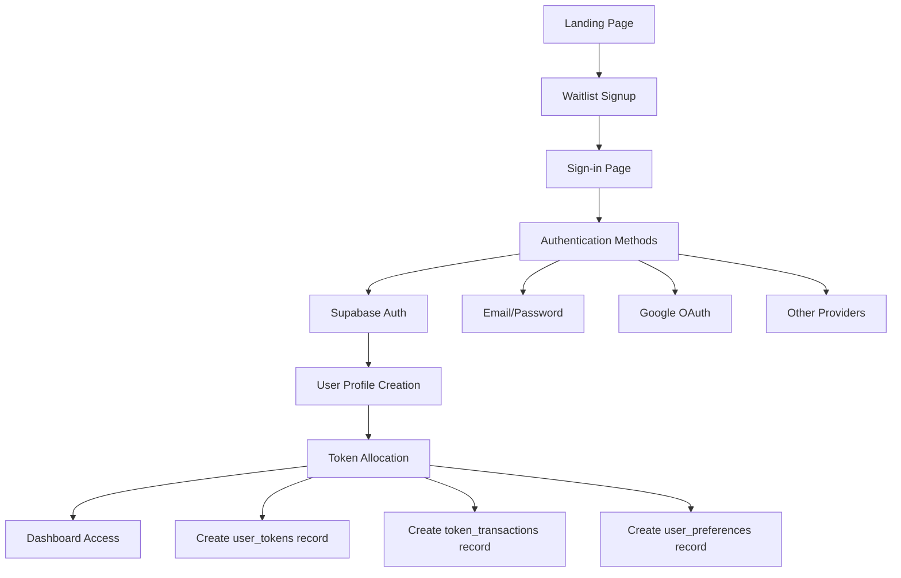

# Design Document

## Overview

The MessyOS authentication flow will be redesigned as a seamless three-stage journey: **Discover → Join → Access**. The system leverages the existing Supabase infrastructure while introducing a streamlined user experience that transitions users from landing page discovery through waitlist signup to authenticated trial access with automatic token allocation.

The design emphasizes the minimalistic Web3 aesthetic while maintaining accessibility for users unfamiliar with crypto concepts. The off-chain token system provides a wallet-like experience without blockchain complexity.

## Architecture

### High-Level Flow Architecture



### System Components

1. **Landing Page Component** - Value proposition and waitlist capture
2. **Waitlist Service** - Email validation and storage
3. **Authentication Service** - Multi-provider auth via Supabase
4. **Token Management Service** - Off-chain wallet simulation
5. **User Onboarding Service** - Profile setup and dashboard initialization
6. **Session Management** - Persistent authentication state

## Components and Interfaces

### 1. Landing Page Component

**Purpose**: Convert visitors to waitlist signups and guide them to authentication

**Key Features**:
- Minimalistic Web3-inspired hero section
- Clear value proposition highlighting life optimization
- Email capture form with validation
- Smooth transition to sign-in page

**Interface**:
```typescript
interface LandingPageProps {
  onWaitlistSubmit: (email: string) => Promise<void>;
  isSubmitting: boolean;
  submitSuccess: boolean;
}

interface WaitlistFormData {
  email: string;
  referrer?: string;
  interestArea?: string;
}
```

### 2. Waitlist Service

**Purpose**: Manage waitlist signups and progression to authentication

**Database Integration**: Uses existing `waitlist` table

**Key Methods**:
```typescript
class WaitlistService {
  async addToWaitlist(data: WaitlistFormData): Promise<void>
  async checkWaitlistStatus(email: string): Promise<WaitlistStatus>
  async markAsActivated(email: string): Promise<void>
}

interface WaitlistStatus {
  exists: boolean;
  activated: boolean;
  signupDate: Date;
}
```

### 3. Authentication Component

**Purpose**: Multi-provider authentication with seamless UX

**Supabase Integration**: Leverages existing auth infrastructure

**Interface**:
```typescript
interface AuthComponentProps {
  onAuthSuccess: (user: User) => void;
  onAuthError: (error: AuthError) => void;
  redirectTo?: string;
}

interface AuthMethods {
  emailPassword: boolean;
  google: boolean;
  github?: boolean;
  apple?: boolean;
}
```

### 4. Token Management Service

**Purpose**: Off-chain wallet simulation with Web3 aesthetics

**Database Integration**: Uses existing `user_tokens` and `token_transactions` tables

**Key Features**:
- Automatic 4800 token allocation for new users
- Transaction history with wallet-like interface
- Real-time balance updates
- Trial period tracking

**Interface**:
```typescript
class TokenService {
  async initializeUserTokens(userId: string): Promise<UserTokens>
  async deductTokens(userId: string, amount: number, description: string): Promise<TokenTransaction>
  async getTokenBalance(userId: string): Promise<number>
  async getTransactionHistory(userId: string): Promise<TokenTransaction[]>
  async checkTrialStatus(userId: string): Promise<TrialStatus>
}

interface UserTokens {
  balance: number;
  totalEarned: number;
  totalSpent: number;
  trialStartDate: Date;
  trialEndDate: Date;
}

interface TrialStatus {
  isActive: boolean;
  daysRemaining: number;
  tokensRemaining: number;
  expiresAt: Date;
}
```

### 5. User Onboarding Service

**Purpose**: Profile setup and dashboard initialization

**Database Integration**: Uses existing `profiles`, `user_preferences`, and `user_ai_preferences` tables

**Key Features**:
- Profile creation with essential information
- Module selection and customization
- AI preferences setup
- Dashboard layout initialization

**Interface**:
```typescript
class OnboardingService {
  async createUserProfile(userId: string, data: ProfileData): Promise<Profile>
  async initializePreferences(userId: string): Promise<UserPreferences>
  async setupAIPreferences(userId: string): Promise<UserAIPreferences>
  async completeOnboarding(userId: string): Promise<void>
}

interface ProfileData {
  fullName: string;
  timezone: string;
  preferredModules: string[];
}
```

## Data Models

### Enhanced User Flow Data

The existing schema supports the auth flow well, but we'll utilize these key tables:

**Waitlist Management**:
- `waitlist` - Email capture and activation tracking
- Enhanced with referrer tracking and interest areas

**User Authentication**:
- `auth.users` - Supabase managed user accounts
- `profiles` - Extended user information
- `user_preferences` - Dashboard and module preferences

**Token System**:
- `user_tokens` - Off-chain wallet balances
- `token_transactions` - Transaction history for wallet interface
- `subscriptions` - Trial and subscription management

### New Data Structures

**Session State Management**:
```typescript
interface AuthState {
  user: User | null;
  session: Session | null;
  isLoading: boolean;
  tokenBalance: number;
  trialStatus: TrialStatus;
}

interface OnboardingState {
  currentStep: 'profile' | 'preferences' | 'modules' | 'complete';
  completedSteps: string[];
  isComplete: boolean;
}
```

## Error Handling

### Authentication Errors

**Email/Password Errors**:
- Invalid email format → Clear validation message
- Weak password → Strength requirements display
- Account already exists → Redirect to sign-in
- Invalid credentials → Generic "Invalid email or password" message

**OAuth Errors**:
- Provider unavailable → Fallback to email/password
- Permission denied → Clear explanation and retry option
- Network issues → Retry mechanism with exponential backoff

**Session Errors**:
- Expired session → Automatic refresh attempt, then redirect to sign-in
- Invalid session → Clear session and redirect to landing page

### Token System Errors

**Insufficient Balance**:
- Display current balance and required amount
- Offer subscription upgrade path
- Provide alternative free features

**Transaction Failures**:
- Retry mechanism for temporary failures
- Clear error messages for permanent failures
- Automatic refund for failed deductions

### Database Errors

**Connection Issues**:
- Retry with exponential backoff
- Offline mode indicators
- Queue operations for when connection restored

**Constraint Violations**:
- Duplicate email → Redirect to sign-in
- Invalid foreign keys → Log error and show generic message

## Testing Strategy

### Unit Testing

**Authentication Service Tests**:
- Email validation logic
- Password strength validation
- OAuth callback handling
- Session management functions

**Token Service Tests**:
- Token allocation logic
- Deduction calculations
- Balance validation
- Transaction recording

**Waitlist Service Tests**:
- Email validation and storage
- Duplicate handling
- Activation status updates

### Integration Testing

**Auth Flow Integration**:
- Complete waitlist → sign-up → token allocation flow
- OAuth provider integration
- Database transaction consistency
- Session persistence across page reloads

**Token System Integration**:
- Token deduction during AI usage
- Balance updates in real-time
- Transaction history accuracy
- Trial expiration handling

### End-to-End Testing

**User Journey Tests**:
- New user: Landing → Waitlist → Sign-up → Dashboard
- Returning user: Sign-in → Dashboard
- Token usage: AI interaction → Balance deduction
- Trial expiration: Access restriction → Subscription prompt

**Mobile PWA Tests**:
- Touch interactions and responsive design
- Add to home screen functionality
- Offline behavior and sync
- Cross-device session consistency

### Performance Testing

**Load Testing**:
- Concurrent user authentication
- Token transaction throughput
- Database query optimization
- API response times under load

**Security Testing**:
- SQL injection prevention
- XSS protection
- CSRF token validation
- Session hijacking prevention

## Security Considerations

### Authentication Security

**Password Security**:
- Minimum 8 characters with complexity requirements
- Bcrypt hashing via Supabase
- Rate limiting on login attempts
- Account lockout after failed attempts

**OAuth Security**:
- PKCE flow for OAuth providers
- State parameter validation
- Secure redirect URI validation
- Token storage in httpOnly cookies

### Session Security

**Session Management**:
- JWT tokens with short expiration
- Automatic refresh token rotation
- Secure cookie settings (httpOnly, secure, sameSite)
- Session invalidation on logout

### Token System Security

**Off-Chain Wallet Security**:
- Server-side balance validation
- Transaction logging and audit trails
- Rate limiting on token operations
- Fraud detection for unusual patterns

### Data Protection

**Privacy Compliance**:
- GDPR-compliant data handling
- User consent for data processing
- Right to deletion implementation
- Data encryption at rest and in transit

## Mobile-First Considerations

### Progressive Web App Features

**Installation**:
- Web app manifest for "Add to Home Screen"
- Service worker for offline functionality
- App-like navigation and interactions

**Touch Optimization**:
- Minimum 44px touch targets
- Swipe gestures for navigation
- Haptic feedback for interactions
- Optimized keyboard inputs

**Performance**:
- Lazy loading for non-critical components
- Image optimization and compression
- Minimal JavaScript bundle size
- Critical CSS inlining

### Responsive Design

**Breakpoint Strategy**:
- Mobile-first CSS approach
- Tablet optimization (768px+)
- Desktop enhancement (1024px+)
- Large screen optimization (1440px+)

**Component Adaptation**:
- Collapsible navigation for mobile
- Touch-friendly form controls
- Optimized modal and overlay sizes
- Readable typography scaling

## Implementation Phases

### Phase 1: Core Authentication (Week 1)
- Landing page with waitlist capture
- Basic email/password authentication
- User profile creation
- Token allocation system

### Phase 2: Enhanced Auth Methods (Week 2)
- Google OAuth integration
- Session management improvements
- Error handling and validation
- Mobile responsive design

### Phase 3: Token System Polish (Week 3)
- Wallet-style interface
- Transaction history
- Trial status tracking
- Real-time balance updates

### Phase 4: Onboarding & UX (Week 4)
- User onboarding flow
- Dashboard initialization
- PWA features
- Performance optimization

This design provides a comprehensive foundation for implementing the MessyOS authentication flow while leveraging the existing Supabase infrastructure and maintaining the minimalistic Web3 aesthetic.