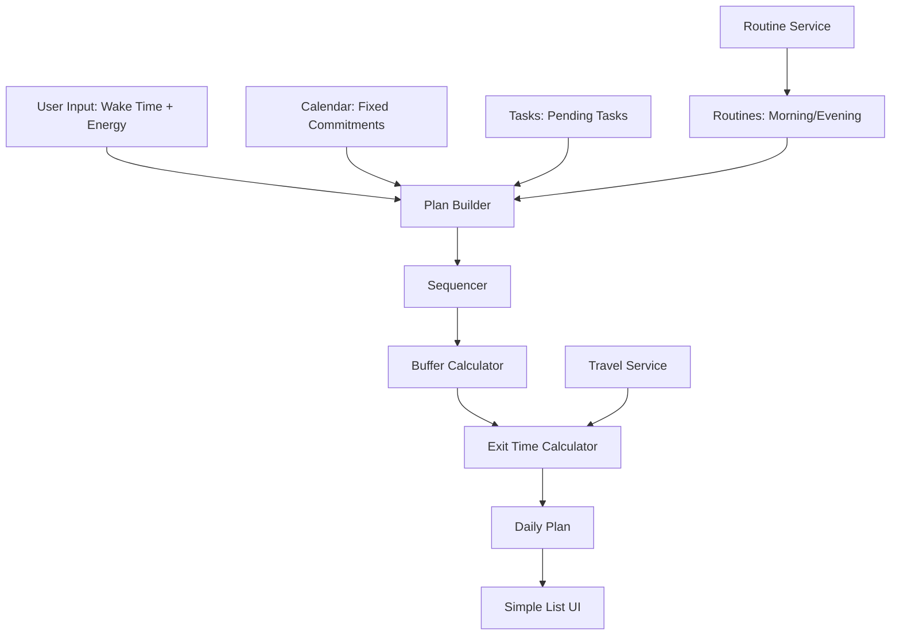

# Design Document: Daily Plan Generator V1 (Spine Only)

## Overview

This is the **Spine V1** — the thin spine that proves the core loop works. No fancy UI, no notifications, no analytics. Just: generate → next action → complete/skip → degrade.

**What's In:**
- Plan generation (wake time + energy → time blocks)
- Exit time calculation (using existing travel service)
- Activity sequencing ("what's next?")
- Plan degradation (drop optional tasks when behind)
- Simple list UI (no timeline visualization)
- Calendar integration (fixed commitments)
- Routine integration (morning/evening blocks)
- Travel integration (exit times only)

**What's Out (V2):**
- Countdown notifications
- Timeline visualization
- Plan history/analytics
- Weather-change alerts
- Meal auto-suggestions
- Substance tracker integration
- Budget overlays

## Architecture

### Minimal System Architecture



## Components

### 1. Plan Builder (Core)

```typescript
// src/lib/daily-plan/plan-builder.ts
interface PlanBuilderService {
  generateDailyPlan(input: PlanInput): Promise<DailyPlan>;
  degradePlan(planId: string): Promise<DailyPlan>;
}

interface PlanInput {
  userId: string;
  date: Date;
  wakeTime: Date;
  sleepTime: Date;
  energyState: 'low' | 'medium' | 'high';
}

interface DailyPlan {
  id: string;
  userId: string;
  date: Date;
  wakeTime: Date;
  sleepTime: Date;
  energyState: 'low' | 'medium' | 'high';
  timeBlocks: TimeBlock[];
  currentIndex: number;
  status: 'active' | 'degraded' | 'completed';
}

interface TimeBlock {
  id: string;
  startTime: Date;
  endTime: Date;
  activityType: 'commitment' | 'task' | 'routine' | 'buffer';
  activityName: string;
  isFixed: boolean;
  status: 'pending' | 'completed' | 'skipped';
}
```

### 2. Exit Time Calculator

```typescript
// src/lib/daily-plan/exit-time-calculator.ts
interface ExitTimeCalculatorService {
  calculateExitTime(commitment: Commitment, currentLocation: Location): ExitTime;
}

interface ExitTime {
  commitmentId: string;
  exitTime: Date;
  travelDuration: number; // minutes
  preparationTime: number; // minutes
  travelMethod: 'bike' | 'train' | 'walk';
}
```

### 3. Simple Sequencer (Derived from time_blocks)

```typescript
// src/lib/daily-plan/sequencer.ts
interface SequencerService {
  getCurrentBlock(plan: DailyPlan): TimeBlock | null;
  getNextBlocks(plan: DailyPlan, count: number): TimeBlock[];
  markBlockComplete(planId: string, blockId: string): Promise<void>;
}

// Implementation derives sequence from time_blocks order
function getCurrentBlock(plan: DailyPlan): TimeBlock | null {
  return plan.timeBlocks.find(block => block.status === 'pending') || null;
}

function getNextBlocks(plan: DailyPlan, count: number): TimeBlock[] {
  const current = getCurrentBlock(plan);
  if (!current) return [];
  
  const currentIndex = plan.timeBlocks.indexOf(current);
  return plan.timeBlocks
    .slice(currentIndex + 1)
    .filter(block => block.status === 'pending')
    .slice(0, count);
}

async function markBlockComplete(planId: string, blockId: string): Promise<void> {
  await db.updateTimeBlock(blockId, { status: 'completed' });
  // Current block updates automatically on next getCurrentBlock() call
}
```

## Database Schema (Minimal)

```sql
-- Daily plans
CREATE TABLE daily_plans (
  id UUID PRIMARY KEY DEFAULT gen_random_uuid(),
  user_id UUID REFERENCES auth.users(id) NOT NULL,
  plan_date DATE NOT NULL,
  wake_time TIMESTAMPTZ NOT NULL,
  sleep_time TIMESTAMPTZ NOT NULL,
  energy_state TEXT NOT NULL CHECK (energy_state IN ('low', 'medium', 'high')),
  current_index INTEGER DEFAULT 0,
  status TEXT NOT NULL CHECK (status IN ('active', 'degraded', 'completed')),
  created_at TIMESTAMPTZ DEFAULT NOW(),
  UNIQUE(user_id, plan_date)
);

-- Time blocks
CREATE TABLE time_blocks (
  id UUID PRIMARY KEY DEFAULT gen_random_uuid(),
  plan_id UUID REFERENCES daily_plans(id) ON DELETE CASCADE,
  start_time TIMESTAMPTZ NOT NULL,
  end_time TIMESTAMPTZ NOT NULL,
  activity_type TEXT NOT NULL CHECK (activity_type IN ('commitment', 'task', 'routine', 'buffer')),
  activity_name TEXT NOT NULL,
  is_fixed BOOLEAN DEFAULT FALSE,
  sequence_order INTEGER NOT NULL,
  status TEXT NOT NULL CHECK (status IN ('pending', 'completed', 'skipped')),
  skip_reason TEXT,
  created_at TIMESTAMPTZ DEFAULT NOW()
);

-- Exit times (simple)
CREATE TABLE exit_times (
  id UUID PRIMARY KEY DEFAULT gen_random_uuid(),
  plan_id UUID REFERENCES daily_plans(id) ON DELETE CASCADE,
  commitment_id UUID NOT NULL,
  exit_time TIMESTAMPTZ NOT NULL,
  travel_duration INTEGER NOT NULL,
  preparation_time INTEGER NOT NULL,
  travel_method TEXT NOT NULL,
  created_at TIMESTAMPTZ DEFAULT NOW()
);
```

## Plan Generation Algorithm (Simplified)

### Step 1: Gather Inputs

```typescript
async function gatherInputs(userId: string, date: Date) {
  const [commitments, tasks, routines] = await Promise.all([
    calendarService.getCommitments(userId, date),
    taskService.getPendingTasks(userId, { limit: 10 }),
    routineService.getActiveRoutines(userId)
  ]);

  return { commitments, tasks, routines };
}
```

### Step 2: Build Activity List

```typescript
function buildActivityList(inputs, energyState: string): Activity[] {
  const activities: Activity[] = [];

  // 1. Morning routine (with fallback)
  const morningRoutine = inputs.routines.morning || { estimatedDuration: 30 };
  activities.push({
    type: 'routine',
    name: 'Morning Routine',
    duration: morningRoutine.estimatedDuration,
    isFixed: false
  });

  // 2. Fixed commitments (will be pinned to their times)
  activities.push(...inputs.commitments.map(c => ({
    type: 'commitment',
    name: c.title,
    duration: calculateDuration(c.startTime, c.endTime),
    isFixed: true,
    startTime: c.startTime,
    location: c.location
  })));

  // 3. Meal blocks (always include)
  activities.push(
    { type: 'meal', name: 'Breakfast', duration: 15, isFixed: false },
    { type: 'meal', name: 'Lunch', duration: 30, isFixed: false },
    { type: 'meal', name: 'Dinner', duration: 45, isFixed: false }
  );

  // 4. Tasks (max 1-3 based on energy)
  const taskLimit = energyState === 'low' ? 1 : energyState === 'medium' ? 2 : 3;
  const selectedTasks = inputs.tasks.slice(0, taskLimit);
  activities.push(...selectedTasks.map(t => ({
    type: 'task',
    name: t.title,
    duration: t.estimatedDuration || 60,
    isFixed: false
  })));

  // 5. Evening routine (with fallback)
  const eveningRoutine = inputs.routines.evening || { estimatedDuration: 20 };
  activities.push({
    type: 'routine',
    name: 'Evening Routine',
    duration: eveningRoutine.estimatedDuration,
    isFixed: false
  });

  return activities;
}
```

### Step 3: Create Time Blocks with Pinned Commitments + Gap-Fill

```typescript
function createTimeBlocks(activities: Activity[], wakeTime: Date, sleepTime: Date): TimeBlock[] {
  const blocks: TimeBlock[] = [];
  
  // Step 1: Pin fixed commitments at their scheduled times
  const commitments = activities.filter(a => a.isFixed);
  const flexibleActivities = activities.filter(a => !a.isFixed);
  
  // Step 2: For each commitment, add travel and prep blocks
  for (const commitment of commitments) {
    const exitTime = calculateExitTime(commitment);
    
    // Add travel block
    blocks.push({
      id: generateId(),
      startTime: exitTime.exitTime,
      endTime: new Date(commitment.startTime.getTime() - exitTime.preparationTime * 60000),
      activityType: 'travel',
      activityName: `Travel to ${commitment.name}`,
      isFixed: true,
      sequenceOrder: 0, // Will be sorted later
      status: 'pending'
    });
    
    // Add commitment block
    blocks.push({
      id: generateId(),
      startTime: commitment.startTime,
      endTime: new Date(commitment.startTime.getTime() + commitment.duration * 60000),
      activityType: 'commitment',
      activityName: commitment.name,
      isFixed: true,
      sequenceOrder: 0,
      status: 'pending'
    });
  }
  
  // Step 3: Sort blocks by start time
  blocks.sort((a, b) => a.startTime.getTime() - b.startTime.getTime());
  
  // Step 4: Fill gaps with flexible activities
  let currentTime = wakeTime;
  const finalBlocks: TimeBlock[] = [];
  
  for (const block of blocks) {
    // Fill gap before this fixed block
    const gapEnd = block.startTime;
    const gapMinutes = (gapEnd.getTime() - currentTime.getTime()) / 60000;
    
    // Try to fit flexible activities in this gap
    while (flexibleActivities.length > 0 && currentTime < gapEnd) {
      const activity = flexibleActivities[0];
      const activityEnd = new Date(currentTime.getTime() + activity.duration * 60000);
      
      // Check if activity fits in gap (with 5-min buffer)
      if (activityEnd.getTime() + 5 * 60000 <= gapEnd.getTime()) {
        finalBlocks.push({
          id: generateId(),
          startTime: currentTime,
          endTime: activityEnd,
          activityType: activity.type,
          activityName: activity.name,
          isFixed: false,
          sequenceOrder: finalBlocks.length + 1,
          status: 'pending'
        });
        
        // Add buffer
        const bufferEnd = new Date(activityEnd.getTime() + 5 * 60000);
        finalBlocks.push({
          id: generateId(),
          startTime: activityEnd,
          endTime: bufferEnd,
          activityType: 'buffer',
          activityName: 'Transition',
          isFixed: false,
          sequenceOrder: finalBlocks.length + 1,
          status: 'pending'
        });
        
        currentTime = bufferEnd;
        flexibleActivities.shift(); // Remove used activity
      } else {
        // Activity doesn't fit, try next gap
        break;
      }
    }
    
    // Add the fixed block
    finalBlocks.push(block);
    currentTime = block.endTime;
    
    // Add buffer after fixed block
    const bufferEnd = new Date(currentTime.getTime() + 5 * 60000);
    finalBlocks.push({
      id: generateId(),
      startTime: currentTime,
      endTime: bufferEnd,
      activityType: 'buffer',
      activityName: 'Transition',
      isFixed: false,
      sequenceOrder: finalBlocks.length + 1,
      status: 'pending'
    });
    currentTime = bufferEnd;
  }
  
  // Fill remaining time after last commitment
  while (flexibleActivities.length > 0 && currentTime < sleepTime) {
    const activity = flexibleActivities.shift();
    const activityEnd = new Date(currentTime.getTime() + activity.duration * 60000);
    
    if (activityEnd > sleepTime) break; // Don't exceed sleep time
    
    finalBlocks.push({
      id: generateId(),
      startTime: currentTime,
      endTime: activityEnd,
      activityType: activity.type,
      activityName: activity.name,
      isFixed: false,
      sequenceOrder: finalBlocks.length + 1,
      status: 'pending'
    });
    
    // Add buffer
    const bufferEnd = new Date(activityEnd.getTime() + 5 * 60000);
    finalBlocks.push({
      id: generateId(),
      startTime: activityEnd,
      endTime: bufferEnd,
      activityType: 'buffer',
      activityName: 'Transition',
      isFixed: false,
      sequenceOrder: finalBlocks.length + 1,
      status: 'pending'
    });
    
    currentTime = bufferEnd;
  }
  
  // Update sequence order
  finalBlocks.forEach((block, index) => {
    block.sequenceOrder = index + 1;
  });
  
  return finalBlocks;
}
```

### Step 4: Calculate Exit Times

```typescript
function calculateExitTimes(plan: DailyPlan, commitments: Commitment[]): ExitTime[] {
  return commitments.map(commitment => {
    const route = travelService.getRoute(userLocation, commitment.location);
    const prepTime = 15; // minutes
    const exitTime = new Date(
      commitment.startTime.getTime() 
      - route.duration * 60000 
      - prepTime * 60000
    );

    return {
      commitmentId: commitment.id,
      exitTime,
      travelDuration: route.duration,
      preparationTime: prepTime,
      travelMethod: route.method
    };
  });
}
```

### Step 5: Degrade Plan (Recompute Buffers)

```typescript
function degradePlan(plan: DailyPlan): DailyPlan {
  // Step 1: Keep only essential activities
  const essentialActivities = plan.timeBlocks.filter(block => 
    block.isFixed || 
    block.activityType === 'routine' ||
    block.activityType === 'meal'
  );

  // Step 2: Mark dropped tasks as skipped
  const droppedBlocks = plan.timeBlocks.filter(block => 
    !essentialActivities.includes(block) && block.activityType !== 'buffer'
  );
  droppedBlocks.forEach(block => {
    block.status = 'skipped';
    block.skipReason = 'Dropped during degradation';
  });

  // Step 3: Rebuild time blocks with recomputed buffers
  const rebuiltBlocks: TimeBlock[] = [];
  let currentTime = plan.wakeTime;
  
  // Sort essential activities by start time
  const sortedActivities = essentialActivities.sort((a, b) => 
    a.startTime.getTime() - b.startTime.getTime()
  );
  
  for (const activity of sortedActivities) {
    // For fixed activities, use their scheduled time
    const startTime = activity.isFixed ? activity.startTime : currentTime;
    const endTime = activity.endTime;
    
    rebuiltBlocks.push({
      ...activity,
      startTime,
      endTime,
      sequenceOrder: rebuiltBlocks.length + 1
    });
    
    // Recompute 5-minute buffer
    const bufferEnd = new Date(endTime.getTime() + 5 * 60000);
    rebuiltBlocks.push({
      id: generateId(),
      startTime: endTime,
      endTime: bufferEnd,
      activityType: 'buffer',
      activityName: 'Transition',
      isFixed: false,
      sequenceOrder: rebuiltBlocks.length + 1,
      status: 'pending'
    });
    
    currentTime = bufferEnd;
  }

  return {
    ...plan,
    timeBlocks: rebuiltBlocks,
    status: 'degraded'
  };
}
```

## API Endpoints (Minimal)

```typescript
// POST /api/daily-plan/generate
// Body: { wakeTime, sleepTime, energyState }
// Returns: DailyPlan

// GET /api/daily-plan/today
// Returns: DailyPlan | null

// PATCH /api/daily-plan/:id/activity/:activityId
// Body: { status: 'completed' | 'skipped', skipReason? }
// Returns: DailyPlan

// POST /api/daily-plan/:id/degrade
// Returns: DailyPlan (degraded)
```

## UI Components (Minimal)

### 1. Plan Generator Form

```typescript
// src/components/daily-plan/PlanGeneratorForm.tsx
interface PlanGeneratorFormProps {
  onGenerate: (input: PlanInput) => void;
}

// Simple form:
// - Wake time picker
// - Sleep time picker (default 23:00)
// - Energy state radio buttons (low/medium/high)
// - "Generate Plan" button
```

### 2. Activity List

```typescript
// src/components/daily-plan/ActivityList.tsx
interface ActivityListProps {
  plan: DailyPlan;
  onComplete: (activityId: string) => void;
  onSkip: (activityId: string, reason: string) => void;
  onDegrade: () => void;
}

// Simple list:
// - Show all time blocks with times
// - Highlight current activity
// - Show "Complete" and "Skip" buttons for current activity
// - Show "Degrade Plan" button if behind schedule
```

### 3. Exit Time Display

```typescript
// src/components/daily-plan/ExitTimeDisplay.tsx
interface ExitTimeDisplayProps {
  exitTimes: ExitTime[];
}

// Simple list:
// - Show exit time for each commitment
// - Show travel method and duration
// - No countdown, no alerts (V2)
```

## Testing Strategy (Minimal)

### Unit Tests

1. **Plan Builder**
   - Test plan generation with low/medium/high energy
   - Test task selection limits (1/2/3 tasks)
   - Test degradation preserves fixed commitments

2. **Exit Time Calculator**
   - Test exit time calculation with travel service
   - Test fallback when travel service fails

3. **Sequencer**
   - Test getCurrentActivity returns correct activity
   - Test advanceSequence moves to next activity

### Integration Test (Critical)

**End-to-End CLI Test:**
```bash
# 1. Generate plan
curl -X POST /api/daily-plan/generate \
  -d '{"wakeTime":"2026-01-18T07:00:00Z","sleepTime":"2026-01-18T23:00:00Z","energyState":"medium"}'

# 2. Fetch plan
curl /api/daily-plan/today

# 3. Complete activity
curl -X PATCH /api/daily-plan/{id}/activity/{activityId} \
  -d '{"status":"completed"}'

# 4. Degrade plan
curl -X POST /api/daily-plan/{id}/degrade
```

This proves the spine works without UI.

## What's Explicitly Deferred to V2

- Countdown notifications (Task 3.1 from original spec)
- Timeline visualization (Requirement 14 from original spec)
- Plan history and analytics (Task 15 from original spec)
- Weather-change notifications (Requirements 2.5, 6.4 from original spec)
- Meal auto-suggestions (Task 13.2 from original spec)
- Substance tracker integration (Task 13.4 from original spec)
- Budget overlay (Task 13.5 from original spec)
- Rich UI polish (color-coded urgency, etc.)

This is the thin spine. It's boring, minimal, and incomplete. But it prevents day collapse, which is the only thing that matters for V1.
