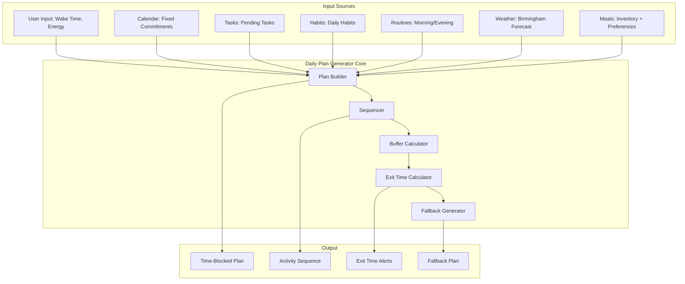

# Design Document

## Overview

The Daily Plan Generator is the core spine of MessyOS — a system that converts messy reality (actual wake time, current energy, weather, commitments) into structured, survivable daily plans. This is not a productivity optimizer; it's a friction-reduction prosthetic designed to prevent the paralysis that comes from unplanned time.

The system integrates with existing MessyOS modules (calendar, tasks, habits, routines, travel, meals) to produce a single unified daily plan with explicit time blocks, sequencing, buffers, and fallback strategies.

**Core Philosophy:**
- Unplanned time → paralysis → guilt → shutdown
- Prevention > optimization
- Degradation > failure
- "What happens next?" > "What's most important?"

## Architecture

### High-Level System Architecture



### Integration with Existing MessyOS

The Daily Plan Generator sits at the center of MessyOS and orchestrates all other modules:

1. **Calendar Integration**: Pulls fixed commitments (classes, appointments)
2. **Task Integration**: Selects up to 3 tasks based on due dates and energy
3. **Habit Integration**: Schedules habit tracking (medication, gym, substance logging)
4. **Routine Integration**: Includes morning/evening routine steps
5. **Travel Integration**: Uses travel optimizer for exit time calculation
6. **Meal Integration**: Schedules meals with cooking/cleanup time
7. **Weather Integration**: Adjusts travel recommendations based on forecast

## Components and Interfaces

### Core Components

#### 1. Plan Builder Service


```typescript
// src/lib/daily-plan/plan-builder.ts
interface PlanBuilderService {
  generateDailyPlan(input: PlanInput): Promise<DailyPlan>;
  regeneratePlan(currentPlan: DailyPlan, reason: RegenerationReason): Promise<DailyPlan>;
  degradePlan(currentPlan: DailyPlan): Promise<DailyPlan>;
}

interface PlanInput {
  userId: string;
  date: Date;
  wakeTime: Date;
  energyState: 'low' | 'medium' | 'high';
  currentLocation: Location;
  preferences: UserPreferences;
}

interface DailyPlan {
  id: string;
  userId: string;
  date: Date;
  wakeTime: Date;
  sleepTime: Date;
  energyState: 'low' | 'medium' | 'high';
  timeBlocks: TimeBlock[];
  sequence: ActivitySequence;
  exitTimes: ExitTime[];
  fallbackPlan: DailyPlan | null;
  status: 'active' | 'degraded' | 'completed' | 'abandoned';
  createdAt: Date;
  updatedAt: Date;
}
```

#### 2. Activity Sequencer

```typescript
// src/lib/daily-plan/sequencer.ts
interface SequencerService {
  createSequence(activities: Activity[]): ActivitySequence;
  resequence(sequence: ActivitySequence, skipActivity: string): ActivitySequence;
  validateSequence(sequence: ActivitySequence): ValidationResult;
}

interface ActivitySequence {
  activities: SequencedActivity[];
  currentIndex: number;
  totalDuration: number;
}

interface SequencedActivity {
  order: number;
  activity: Activity;
  dependencies: string[]; // IDs of activities that must come before
  status: 'pending' | 'in-progress' | 'completed' | 'skipped';
}
```

#### 3. Buffer Calculator

```typescript
// src/lib/daily-plan/buffer-calculator.ts
interface BufferCalculatorService {
  calculateTransitionBuffer(from: Activity, to: Activity): number;
  calculatePreparationBuffer(activity: Activity): number;
  calculateTravelBuffer(route: TravelRoute, weather: WeatherData): number;
}

interface BufferConfig {
  minimumTransition: number; // 5 minutes default
  travelPreparation: number; // 10 minutes default
  mealCleanup: number; // 10 minutes default
  routineBuffer: number; // 15% of routine time
  weatherMultiplier: number; // 1.2x for rain, 1.5x for snow
}
```

#### 4. Exit Time Calculator

```typescript
// src/lib/daily-plan/exit-time-calculator.ts
interface ExitTimeCalculatorService {
  calculateExitTime(commitment: FixedCommitment, currentLocation: Location): ExitTime;
  recalculateExitTime(exitTime: ExitTime, newConditions: TravelConditions): ExitTime;
  getExitTimeAlerts(exitTime: ExitTime): Alert[];
}

interface ExitTime {
  commitmentId: string;
  commitmentStartTime: Date;
  exitTime: Date;
  arrivalTime: Date;
  travelMethod: 'bike' | 'train' | 'walk';
  travelDuration: number;
  preparationTime: number;
  buffer: number;
  weatherConditions: WeatherData;
  alerts: Alert[];
}
```

#### 5. Fallback Plan Generator

```typescript
// src/lib/daily-plan/fallback-generator.ts
interface FallbackGeneratorService {
  generateFallback(primaryPlan: DailyPlan): DailyPlan;
  shouldActivateFallback(currentPlan: DailyPlan, currentTime: Date): boolean;
}

interface FallbackStrategy {
  preserveFixedCommitments: boolean;
  dropOptionalTasks: boolean;
  simplifyRoutines: boolean;
  reduceMealComplexity: boolean;
  increaseBuffers: boolean;
}
```

## Data Models

### Database Schema

```sql
-- Daily plans table
CREATE TABLE daily_plans (
  id UUID PRIMARY KEY DEFAULT gen_random_uuid(),
  user_id UUID REFERENCES auth.users(id) NOT NULL,
  plan_date DATE NOT NULL,
  wake_time TIMESTAMPTZ NOT NULL,
  sleep_time TIMESTAMPTZ NOT NULL,
  energy_state TEXT NOT NULL CHECK (energy_state IN ('low', 'medium', 'high')),
  status TEXT NOT NULL CHECK (status IN ('active', 'degraded', 'completed', 'abandoned')),
  is_fallback BOOLEAN DEFAULT FALSE,
  parent_plan_id UUID REFERENCES daily_plans(id),
  created_at TIMESTAMPTZ DEFAULT NOW(),
  updated_at TIMESTAMPTZ DEFAULT NOW(),
  UNIQUE(user_id, plan_date, is_fallback)
);

-- Time blocks table
CREATE TABLE time_blocks (
  id UUID PRIMARY KEY DEFAULT gen_random_uuid(),
  plan_id UUID REFERENCES daily_plans(id) ON DELETE CASCADE,
  start_time TIMESTAMPTZ NOT NULL,
  end_time TIMESTAMPTZ NOT NULL,
  activity_type TEXT NOT NULL, -- 'routine', 'task', 'meal', 'travel', 'commitment', 'buffer'
  activity_id UUID, -- Reference to specific activity in other tables
  activity_name TEXT NOT NULL,
  sequence_order INTEGER NOT NULL,
  is_fixed BOOLEAN DEFAULT FALSE,
  status TEXT NOT NULL CHECK (status IN ('pending', 'in-progress', 'completed', 'skipped')),
  actual_start_time TIMESTAMPTZ,
  actual_end_time TIMESTAMPTZ,
  skip_reason TEXT,
  created_at TIMESTAMPTZ DEFAULT NOW()
);

-- Exit times table
CREATE TABLE exit_times (
  id UUID PRIMARY KEY DEFAULT gen_random_uuid(),
  plan_id UUID REFERENCES daily_plans(id) ON DELETE CASCADE,
  commitment_id UUID NOT NULL,
  commitment_start_time TIMESTAMPTZ NOT NULL,
  exit_time TIMESTAMPTZ NOT NULL,
  arrival_time TIMESTAMPTZ NOT NULL,
  travel_method TEXT NOT NULL CHECK (travel_method IN ('bike', 'train', 'walk')),
  travel_duration INTEGER NOT NULL, -- minutes
  preparation_time INTEGER NOT NULL, -- minutes
  buffer_time INTEGER NOT NULL, -- minutes
  weather_conditions JSONB,
  created_at TIMESTAMPTZ DEFAULT NOW()
);

-- Plan completion tracking
CREATE TABLE plan_completions (
  id UUID PRIMARY KEY DEFAULT gen_random_uuid(),
  plan_id UUID REFERENCES daily_plans(id) ON DELETE CASCADE,
  completion_rate NUMERIC(5,2), -- percentage
  activities_completed INTEGER,
  activities_total INTEGER,
  activities_skipped INTEGER,
  average_delay_minutes INTEGER,
  fallback_activated BOOLEAN DEFAULT FALSE,
  user_notes TEXT,
  created_at TIMESTAMPTZ DEFAULT NOW()
);
```

### TypeScript Interfaces

```typescript
// Core data models

interface TimeBlock {
  id: string;
  planId: string;
  startTime: Date;
  endTime: Date;
  activityType: 'routine' | 'task' | 'meal' | 'travel' | 'commitment' | 'buffer';
  activityId?: string;
  activityName: string;
  sequenceOrder: number;
  isFixed: boolean;
  status: 'pending' | 'in-progress' | 'completed' | 'skipped';
  actualStartTime?: Date;
  actualEndTime?: Date;
  skipReason?: string;
}

interface Activity {
  id: string;
  type: 'routine' | 'task' | 'meal' | 'travel' | 'commitment' | 'habit';
  name: string;
  estimatedDuration: number; // minutes
  energyCost: 'low' | 'medium' | 'high';
  isFixed: boolean;
  dependencies: string[];
  location?: Location;
  metadata: Record<string, any>;
}

interface Location {
  name: string;
  coordinates: [number, number];
  type: 'home' | 'university' | 'gym' | 'store' | 'other';
}

interface UserPreferences {
  defaultWakeTime: string; // "07:00"
  defaultSleepTime: string; // "23:00"
  maxTasksPerDay: number; // 3
  minimumBufferMinutes: number; // 5
  travelPreference: 'bike' | 'train' | 'mixed';
  weatherThreshold: number; // 0.5 = 50% rain chance
}
```

## Plan Generation Algorithm

### Step 1: Gather Inputs

```typescript
async function gatherInputs(userId: string, date: Date): Promise<PlanInputs> {
  const [
    fixedCommitments,
    pendingTasks,
    dailyHabits,
    routines,
    weather,
    mealPlan,
    userPreferences
  ] = await Promise.all([
    calendarService.getCommitments(userId, date),
    taskService.getPendingTasks(userId, { limit: 10 }),
    habitService.getDailyHabits(userId),
    routineService.getActiveRoutines(userId),
    weatherService.getForecast('Birmingham', date),
    mealService.getMealPlan(userId, date),
    userService.getPreferences(userId)
  ]);

  return {
    fixedCommitments,
    pendingTasks,
    dailyHabits,
    routines,
    weather,
    mealPlan,
    userPreferences
  };
}
```

### Step 2: Build Activity List

```typescript
function buildActivityList(inputs: PlanInputs, energyState: string): Activity[] {
  const activities: Activity[] = [];

  // 1. Add fixed commitments (non-negotiable)
  activities.push(...inputs.fixedCommitments.map(c => ({
    id: c.id,
    type: 'commitment',
    name: c.title,
    estimatedDuration: calculateDuration(c.startTime, c.endTime),
    energyCost: 'medium',
    isFixed: true,
    dependencies: [],
    location: c.location
  })));

  // 2. Add morning routine
  if (inputs.routines.morning) {
    activities.push({
      id: 'morning-routine',
      type: 'routine',
      name: 'Morning Routine',
      estimatedDuration: inputs.routines.morning.estimatedDuration,
      energyCost: 'low',
      isFixed: false,
      dependencies: []
    });
  }

  // 3. Add meals
  activities.push(
    { id: 'breakfast', type: 'meal', name: 'Breakfast', estimatedDuration: 10, energyCost: 'low', isFixed: false, dependencies: ['morning-routine'] },
    { id: 'lunch', type: 'meal', name: 'Lunch', estimatedDuration: 20, energyCost: 'low', isFixed: false, dependencies: [] },
    { id: 'dinner', type: 'meal', name: 'Dinner', estimatedDuration: 30, energyCost: 'low', isFixed: false, dependencies: [] }
  );

  // 4. Add habits (gym, medication, etc.)
  activities.push(...inputs.dailyHabits.map(h => ({
    id: h.id,
    type: 'habit',
    name: h.name,
    estimatedDuration: h.estimatedDuration || 60,
    energyCost: h.energyCost || 'medium',
    isFixed: false,
    dependencies: []
  })));

  // 5. Add tasks (max 3, filtered by energy)
  const taskLimit = energyState === 'low' ? 1 : energyState === 'medium' ? 2 : 3;
  const selectedTasks = selectTasks(inputs.pendingTasks, taskLimit, energyState);
  activities.push(...selectedTasks.map(t => ({
    id: t.id,
    type: 'task',
    name: t.title,
    estimatedDuration: t.estimatedDuration || 60,
    energyCost: t.energyCost || 'medium',
    isFixed: false,
    dependencies: []
  })));

  // 6. Add evening routine
  if (inputs.routines.evening) {
    activities.push({
      id: 'evening-routine',
      type: 'routine',
      name: 'Evening Routine',
      estimatedDuration: inputs.routines.evening.estimatedDuration,
      energyCost: 'low',
      isFixed: false,
      dependencies: []
    });
  }

  return activities;
}
```

### Step 3: Create Time Blocks

```typescript
function createTimeBlocks(
  activities: Activity[],
  wakeTime: Date,
  sleepTime: Date,
  weather: WeatherData
): TimeBlock[] {
  const blocks: TimeBlock[] = [];
  let currentTime = wakeTime;

  // Sort activities: fixed commitments first, then by dependencies
  const sortedActivities = topologicalSort(activities);

  for (const activity of sortedActivities) {
    // Calculate start time
    const startTime = activity.isFixed 
      ? activity.startTime 
      : currentTime;

    // Calculate end time
    const endTime = new Date(startTime.getTime() + activity.estimatedDuration * 60000);

    // Add the activity block
    blocks.push({
      id: generateId(),
      planId: '', // Set later
      startTime,
      endTime,
      activityType: activity.type,
      activityId: activity.id,
      activityName: activity.name,
      sequenceOrder: blocks.length + 1,
      isFixed: activity.isFixed,
      status: 'pending'
    });

    // Add buffer block
    const bufferDuration = calculateBuffer(activity, weather);
    const bufferEnd = new Date(endTime.getTime() + bufferDuration * 60000);
    
    blocks.push({
      id: generateId(),
      planId: '',
      startTime: endTime,
      endTime: bufferEnd,
      activityType: 'buffer',
      activityName: 'Transition',
      sequenceOrder: blocks.length + 1,
      isFixed: false,
      status: 'pending'
    });

    currentTime = bufferEnd;

    // Stop if we've reached sleep time
    if (currentTime >= sleepTime) break;
  }

  return blocks;
}
```

### Step 4: Calculate Exit Times

```typescript
function calculateExitTimes(
  plan: DailyPlan,
  fixedCommitments: FixedCommitment[],
  currentLocation: Location,
  weather: WeatherData
): ExitTime[] {
  return fixedCommitments.map(commitment => {
    // Get travel route
    const route = travelService.getRoute(
      currentLocation,
      commitment.location,
      weather
    );

    // Calculate preparation time
    const prepTime = commitment.type === 'class' ? 15 : 10;

    // Calculate exit time
    const exitTime = new Date(
      commitment.startTime.getTime() 
      - route.duration * 60000 
      - prepTime * 60000 
      - 5 * 60000 // 5 min buffer
    );

    return {
      commitmentId: commitment.id,
      commitmentStartTime: commitment.startTime,
      exitTime,
      arrivalTime: new Date(commitment.startTime.getTime() - 5 * 60000),
      travelMethod: route.method,
      travelDuration: route.duration,
      preparationTime: prepTime,
      buffer: 5,
      weatherConditions: weather,
      alerts: generateAlerts(exitTime)
    };
  });
}
```

### Step 5: Generate Fallback Plan

```typescript
function generateFallbackPlan(primaryPlan: DailyPlan): DailyPlan {
  // Keep only fixed commitments and essential activities
  const essentialBlocks = primaryPlan.timeBlocks.filter(block => 
    block.isFixed || 
    block.activityType === 'meal' ||
    block.activityType === 'routine'
  );

  // Increase all buffers by 50%
  const adjustedBlocks = essentialBlocks.map(block => ({
    ...block,
    endTime: block.activityType === 'buffer'
      ? new Date(block.endTime.getTime() + (block.endTime.getTime() - block.startTime.getTime()) * 0.5)
      : block.endTime
  }));

  return {
    ...primaryPlan,
    id: generateId(),
    timeBlocks: adjustedBlocks,
    status: 'active',
    fallbackPlan: null // No fallback for fallback
  };
}
```

## Error Handling

### 1. Impossible Schedule Detection

```typescript
function validateSchedule(plan: DailyPlan): ValidationResult {
  const issues: string[] = [];

  // Check for overlapping blocks
  for (let i = 0; i < plan.timeBlocks.length - 1; i++) {
    const current = plan.timeBlocks[i];
    const next = plan.timeBlocks[i + 1];
    
    if (current.endTime > next.startTime) {
      issues.push(`Overlap detected: ${current.activityName} and ${next.activityName}`);
    }
  }

  // Check for insufficient sleep
  const totalDuration = plan.timeBlocks.reduce((sum, block) => 
    sum + (block.endTime.getTime() - block.startTime.getTime()), 0
  );
  const availableTime = plan.sleepTime.getTime() - plan.wakeTime.getTime();
  
  if (totalDuration > availableTime) {
    issues.push('Schedule exceeds available time');
  }

  return {
    valid: issues.length === 0,
    issues
  };
}
```

### 2. Graceful Degradation

```typescript
async function handleScheduleFailure(plan: DailyPlan): Promise<DailyPlan> {
  // Try removing optional tasks first
  let adjustedPlan = removeOptionalTasks(plan);
  
  if (!validateSchedule(adjustedPlan).valid) {
    // Try simplifying routines
    adjustedPlan = simplifyRoutines(adjustedPlan);
  }
  
  if (!validateSchedule(adjustedPlan).valid) {
    // Last resort: activate fallback
    adjustedPlan = plan.fallbackPlan || generateMinimalPlan(plan);
  }
  
  return adjustedPlan;
}
```

## Testing Strategy

### Unit Tests

1. **Plan Builder Tests**
   - Test plan generation with various energy states
   - Test plan generation with different numbers of commitments
   - Test plan generation with impossible schedules

2. **Sequencer Tests**
   - Test dependency resolution
   - Test resequencing after skipped activities
   - Test circular dependency detection

3. **Buffer Calculator Tests**
   - Test buffer calculation for different activity types
   - Test weather impact on buffers
   - Test minimum buffer enforcement

4. **Exit Time Calculator Tests**
   - Test exit time calculation for different travel methods
   - Test exit time recalculation when conditions change
   - Test alert generation at correct intervals

5. **Fallback Generator Tests**
   - Test fallback plan preserves fixed commitments
   - Test fallback plan drops optional activities
   - Test fallback plan increases buffers

### Integration Tests

1. **End-to-End Plan Generation**
   - Test complete plan generation from user input to database
   - Test plan execution tracking
   - Test plan degradation workflow

2. **Cross-Module Integration**
   - Test calendar integration
   - Test task selection
   - Test habit scheduling
   - Test routine integration
   - Test meal planning integration

### Property-Based Tests

1. **Schedule Validity**
   - For any generated plan, no time blocks should overlap
   - For any generated plan, total duration should not exceed available time
   - For any generated plan, fixed commitments should be preserved

2. **Exit Time Accuracy**
   - For any exit time, arrival time should be before commitment start time
   - For any exit time, travel duration + prep time + buffer should equal time difference

3. **Fallback Plan Correctness**
   - For any fallback plan, it should have fewer activities than primary plan
   - For any fallback plan, all fixed commitments should be preserved
   - For any fallback plan, buffers should be larger than primary plan

This design provides a comprehensive foundation for implementing the Daily Plan Generator — the missing keystone of MessyOS.
