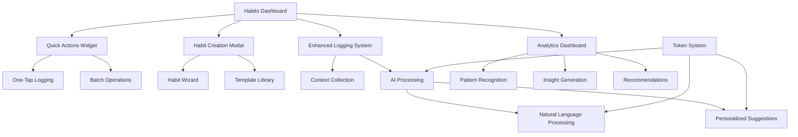
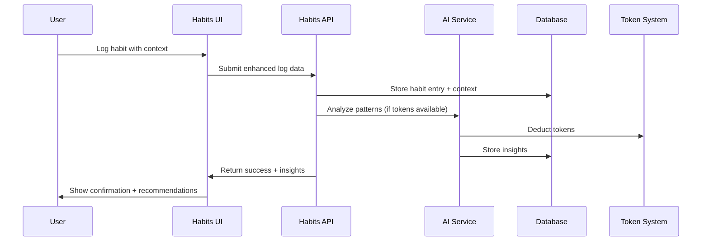

# Design Document

## Overview

The Habits module enhancement builds upon the existing solid foundation to create a production-ready, intelligent habit tracking system. The current system already has excellent streak tracking, enhanced logging with context data, and Loop Habits import functionality. This design focuses on polishing the user experience, adding missing UI components, implementing AI-powered insights, and creating seamless mobile interactions.

The enhanced system will serve as MessyOS's flagship feature, demonstrating the platform's ability to provide deep, contextual life optimization rather than simple tracking.

## Architecture

### Current System Strengths
- **Robust Database Schema**: Well-designed `habits` and `habit_entries` tables with proper relationships
- **Advanced Context Tracking**: Effort, mood, energy, location, weather, and custom tags
- **Accurate Streak Calculation**: Fixed logic that properly handles different habit types
- **Beautiful UI**: Web3-inspired design with excellent visual feedback
- **Import System**: Working Loop Habits CSV import with proper data transformation

### Enhancement Architecture



### Data Flow Enhancement



## Components and Interfaces

### 1. Enhanced Habit Creation System

**Purpose**: Replace the missing "New Habit" functionality with an intuitive creation flow

**Current Gap**: The "New Habit" button exists but doesn't have a working modal

**Design Solution**:
```typescript
interface HabitCreationModal {
  step: 'basic' | 'measurement' | 'preferences' | 'review';
  habitData: NewHabitData;
  templates: HabitTemplate[];
  onSave: (habit: NewHabitData) => Promise<void>;
  onCancel: () => void;
}

interface NewHabitData {
  name: string;
  description?: string;
  category: string;
  type: 'build' | 'break' | 'maintain';
  measurement_type: 'boolean' | 'count' | 'duration';
  target_value?: number;
  target_unit?: string;
  color: string;
  reminder_time?: string;
  allows_skips: boolean;
}

interface HabitTemplate {
  id: string;
  name: string;
  category: string;
  type: 'build' | 'break' | 'maintain';
  measurement_type: 'boolean' | 'count' | 'duration';
  description: string;
  suggested_target?: number;
  color: string;
}
```

**UI Flow**:
1. **Basic Info**: Name, description, category selection
2. **Measurement**: Type (boolean/count/duration), target values
3. **Preferences**: Color, reminders, skip policy
4. **Review**: Preview habit card, confirm creation

### 2. AI-Powered Insights Engine

**Purpose**: Transform collected context data into actionable insights and recommendations

**Current Gap**: Rich context data is collected but not analyzed for patterns

**Design Solution**:
```typescript
interface InsightsEngine {
  generatePersonalizedInsights(userId: string, habitId?: string): Promise<HabitInsights>;
  analyzeOptimalConditions(userId: string, habitId: string): Promise<OptimalConditions>;
  suggestImprovements(userId: string): Promise<ImprovementSuggestion[]>;
  processNaturalLanguageLog(input: string): Promise<ParsedHabitLog[]>;
}

interface HabitInsights {
  completionPatterns: {
    bestDays: string[];
    bestTimes: string[];
    successFactors: ContextFactor[];
  };
  streakAnalysis: {
    averageStreak: number;
    longestStreak: number;
    breakPatterns: string[];
  };
  recommendations: Recommendation[];
  correlations: HabitCorrelation[];
}

interface OptimalConditions {
  bestMood: number;
  bestEnergyLevel: number;
  optimalLocations: string[];
  favorableWeather: string[];
  successfulContextTags: string[];
}

interface Recommendation {
  type: 'timing' | 'context' | 'approach' | 'goal';
  title: string;
  description: string;
  confidence: number;
  actionable: boolean;
  tokenCost?: number;
}
```

### 3. Mobile Quick Actions Widget

**Purpose**: Enable rapid habit logging for busy mobile users

**Current Gap**: Enhanced logging is comprehensive but can be too detailed for quick updates

**Design Solution**:
```typescript
interface QuickActionsWidget {
  pendingHabits: HabitQuickAction[];
  completedToday: number;
  totalHabits: number;
  onQuickLog: (habitId: string, value: number) => Promise<void>;
  onBatchComplete: (habitIds: string[]) => Promise<void>;
}

interface HabitQuickAction {
  id: string;
  name: string;
  type: 'build' | 'break' | 'maintain';
  measurement_type: 'boolean' | 'count' | 'duration';
  color: string;
  currentStreak: number;
  quickLogEnabled: boolean;
}
```

**Mobile UI Features**:
- **Swipe Actions**: Swipe right to complete, left for detailed logging
- **Batch Mode**: Select multiple habits for quick completion
- **Voice Input**: "Mark exercise and meditation as done"
- **Offline Queue**: Store logs locally, sync when online

### 4. Enhanced Analytics Dashboard

**Purpose**: Visualize patterns and provide actionable insights from context data

**Current Gap**: Basic stats exist but no deep pattern analysis or recommendations

**Design Solution**:
```typescript
interface AnalyticsDashboard {
  timeRange: '7d' | '30d' | '90d' | '1y';
  selectedHabits: string[];
  insights: AnalyticsInsight[];
  charts: ChartData[];
  correlations: CrossHabitCorrelation[];
}

interface AnalyticsInsight {
  type: 'pattern' | 'correlation' | 'trend' | 'anomaly';
  title: string;
  description: string;
  data: any;
  actionable: boolean;
  confidence: number;
}

interface CrossHabitCorrelation {
  habit1: string;
  habit2: string;
  correlation: number;
  insight: string;
  recommendation?: string;
}
```

**Visualization Components**:
- **Heatmap Calendar**: Visual completion patterns over time
- **Context Success Rates**: Bar charts showing success by mood, energy, location
- **Streak Timeline**: Interactive timeline of streaks and breaks
- **Correlation Matrix**: How habits influence each other
- **Optimal Conditions**: Radar chart of best conditions for success

### 5. Natural Language Processing Integration

**Purpose**: Allow users to log multiple habits using conversational input

**Design Solution**:
```typescript
interface NaturalLanguageProcessor {
  parseHabitLog(input: string, userId: string): Promise<ParsedLogEntry[]>;
  suggestHabits(description: string): Promise<HabitSuggestion[]>;
  generateInsightSummary(userId: string): Promise<string>;
}

interface ParsedLogEntry {
  habitId?: string;
  habitName: string;
  value: number;
  confidence: number;
  date?: string;
  notes?: string;
  suggestedContext?: ContextData;
}

interface ContextData {
  effort?: number;
  mood?: number;
  energy?: number;
  location?: string;
  weather?: string;
  tags?: string[];
}
```

**Example Interactions**:
- "I exercised for 45 minutes and meditated this morning"
- "Yesterday I skipped gym but did my reading"
- "Mark workout, meditation, and journaling as done"

## Data Models

### Enhanced Database Schema

**New Tables**:
```sql
-- Habit templates for quick creation
CREATE TABLE habit_templates (
  id UUID PRIMARY KEY DEFAULT gen_random_uuid(),
  name TEXT NOT NULL,
  category TEXT NOT NULL,
  type habit_type NOT NULL,
  measurement_type measurement_type NOT NULL,
  description TEXT,
  suggested_target INTEGER,
  target_unit TEXT,
  color TEXT DEFAULT '#3B82F6',
  is_popular BOOLEAN DEFAULT false,
  created_at TIMESTAMP WITH TIME ZONE DEFAULT NOW()
);

-- AI-generated insights
CREATE TABLE habit_insights (
  id UUID PRIMARY KEY DEFAULT gen_random_uuid(),
  user_id UUID REFERENCES auth.users(id) ON DELETE CASCADE,
  habit_id UUID REFERENCES habits(id) ON DELETE CASCADE,
  insight_type TEXT NOT NULL, -- 'pattern', 'correlation', 'recommendation'
  title TEXT NOT NULL,
  description TEXT NOT NULL,
  data JSONB,
  confidence DECIMAL(3,2),
  is_actionable BOOLEAN DEFAULT false,
  created_at TIMESTAMP WITH TIME ZONE DEFAULT NOW(),
  expires_at TIMESTAMP WITH TIME ZONE
);

-- Cross-habit correlations
CREATE TABLE habit_correlations (
  id UUID PRIMARY KEY DEFAULT gen_random_uuid(),
  user_id UUID REFERENCES auth.users(id) ON DELETE CASCADE,
  habit1_id UUID REFERENCES habits(id) ON DELETE CASCADE,
  habit2_id UUID REFERENCES habits(id) ON DELETE CASCADE,
  correlation_score DECIMAL(3,2),
  insight TEXT,
  last_calculated TIMESTAMP WITH TIME ZONE DEFAULT NOW()
);
```

**Enhanced Existing Tables**:
```sql
-- Add missing fields to habits table
ALTER TABLE habits ADD COLUMN IF NOT EXISTS measurement_type TEXT DEFAULT 'boolean';
ALTER TABLE habits ADD COLUMN IF NOT EXISTS allows_skips BOOLEAN DEFAULT false;
ALTER TABLE habits ADD COLUMN IF NOT EXISTS reminder_time TIME;
ALTER TABLE habits ADD COLUMN IF NOT EXISTS position INTEGER DEFAULT 0;
ALTER TABLE habits ADD COLUMN IF NOT EXISTS best_streak INTEGER DEFAULT 0;

-- Ensure habit_entries has all context fields
ALTER TABLE habit_entries ADD COLUMN IF NOT EXISTS effort INTEGER CHECK (effort >= 1 AND effort <= 5);
ALTER TABLE habit_entries ADD COLUMN IF NOT EXISTS energy_level INTEGER CHECK (energy_level >= 1 AND energy_level <= 5);
ALTER TABLE habit_entries ADD COLUMN IF NOT EXISTS mood INTEGER CHECK (mood >= 1 AND mood <= 5);
ALTER TABLE habit_entries ADD COLUMN IF NOT EXISTS location TEXT;
ALTER TABLE habit_entries ADD COLUMN IF NOT EXISTS weather TEXT;
ALTER TABLE habit_entries ADD COLUMN IF NOT EXISTS context_tags TEXT[];
ALTER TABLE habit_entries ADD COLUMN IF NOT EXISTS duration_minutes INTEGER;
ALTER TABLE habit_entries ADD COLUMN IF NOT EXISTS completion_time TIME;
```

## Error Handling

### Enhanced Logging Reliability

**Current Issues**:
- Enhanced logging modal may not save context data properly
- Streak calculations can be inconsistent
- Import process lacks detailed error reporting

**Solutions**:

1. **Robust Form Validation**:
```typescript
interface LoggingValidation {
  validateContextData(data: ContextData): ValidationResult;
  sanitizeInput(input: any): any;
  handlePartialFailures(results: SaveResult[]): void;
}
```

2. **Optimistic Updates with Rollback**:
```typescript
interface OptimisticUpdate {
  updateUI(habitId: string, newData: any): void;
  rollbackOnFailure(habitId: string, originalData: any): void;
  retryWithExponentialBackoff(operation: () => Promise<any>): Promise<any>;
}
```

3. **Detailed Error Context**:
```typescript
interface HabitError extends Error {
  code: 'VALIDATION_FAILED' | 'NETWORK_ERROR' | 'PERMISSION_DENIED' | 'QUOTA_EXCEEDED';
  habitId?: string;
  context?: any;
  retryable: boolean;
  userMessage: string;
}
```

## Testing Strategy

### Unit Testing Priorities

1. **Streak Calculation Logic**:
   - Test edge cases (timezone changes, daylight saving)
   - Verify different habit types (build vs break)
   - Test retroactive logging impact on streaks

2. **Context Data Processing**:
   - Validate all context fields save correctly
   - Test data sanitization and validation
   - Verify analytics calculations

3. **AI Integration**:
   - Mock AI responses for consistent testing
   - Test token deduction logic
   - Verify insight generation accuracy

### Integration Testing

1. **End-to-End Habit Flows**:
   - Create habit → Log entries → View analytics
   - Import Loop Habits → Verify data integrity
   - Enhanced logging → Context analysis → Insights

2. **Mobile PWA Testing**:
   - Offline logging and sync
   - Touch interactions and gestures
   - Performance on low-end devices

3. **Cross-Module Integration**:
   - Habit completion affecting overall MessyOS score
   - Health data correlation with habit success
   - Token system integration

## Performance Considerations

### Database Optimization

1. **Indexing Strategy**:
```sql
-- Optimize habit queries
CREATE INDEX idx_habits_user_active ON habits(user_id, is_active);
CREATE INDEX idx_habit_entries_habit_date ON habit_entries(habit_id, date);
CREATE INDEX idx_habit_entries_user_date ON habit_entries(user_id, date);

-- Analytics queries
CREATE INDEX idx_habit_entries_context ON habit_entries USING GIN(context_tags);
CREATE INDEX idx_habit_insights_user_type ON habit_insights(user_id, insight_type);
```

2. **Query Optimization**:
   - Paginate habit entries for large datasets
   - Cache frequently accessed analytics
   - Use materialized views for complex aggregations

### Frontend Performance

1. **Lazy Loading**:
   - Load analytics dashboard components on demand
   - Virtualize long habit lists
   - Progressive image loading for charts

2. **Caching Strategy**:
   - Cache habit data in localStorage
   - Implement service worker for offline functionality
   - Use React Query for intelligent data fetching

## Security Considerations

### Data Privacy

1. **Context Data Protection**:
   - Encrypt sensitive context information
   - Allow users to control data retention periods
   - Provide granular privacy controls

2. **AI Processing Security**:
   - Anonymize data sent to AI services
   - Implement rate limiting for AI features
   - Audit AI-generated insights for accuracy

### Token System Security

1. **Usage Validation**:
   - Server-side token balance verification
   - Prevent client-side manipulation
   - Audit trail for all token transactions

## Mobile-First Enhancements

### Progressive Web App Features

1. **Offline Functionality**:
   - Queue habit logs when offline
   - Sync data when connection restored
   - Show offline indicators

2. **Native-Like Experience**:
   - Push notifications for habit reminders
   - Background sync for data updates
   - App shortcuts for quick actions

### Touch Optimization

1. **Gesture Support**:
   - Swipe to complete habits
   - Pull to refresh habit list
   - Long press for context menus

2. **Accessibility**:
   - Voice commands for logging
   - High contrast mode support
   - Screen reader optimization

## Implementation Phases

### Phase 1: Core Missing Features (Week 1)
- Implement habit creation modal with wizard flow
- Fix enhanced logging data persistence
- Add habit templates library
- Create mobile quick actions widget

### Phase 2: Analytics & Insights (Week 2)
- Build analytics dashboard with visualizations
- Implement pattern recognition algorithms
- Create insight generation system
- Add cross-habit correlation analysis

### Phase 3: AI Integration (Week 3)
- Integrate natural language processing
- Implement personalized recommendations
- Add AI-powered habit suggestions
- Create intelligent coaching features

### Phase 4: Polish & Performance (Week 4)
- Optimize database queries and indexing
- Implement offline functionality
- Add push notifications
- Performance testing and optimization

This design builds upon your existing solid foundation while adding the missing pieces to create a truly compelling habits module that showcases MessyOS's potential for intelligent life optimization.