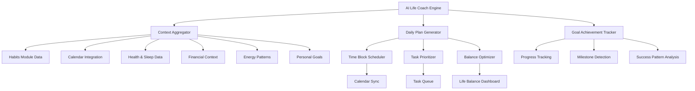
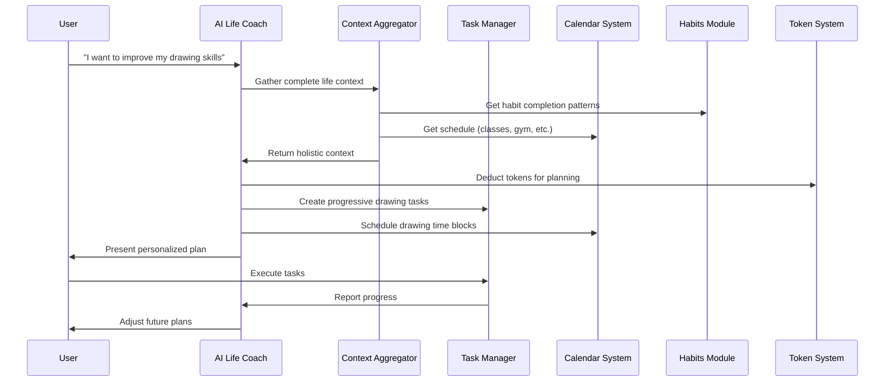
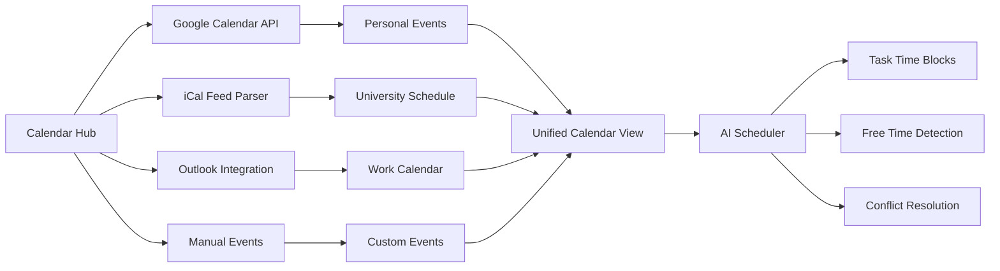

# Design Document

## Overview

The Intelligent Task Management module represents a paradigm shift from traditional todo lists to a holistic life optimization system. This module serves as the central nervous system of MessyOS, coordinating between all other modules (habits, health, finance, nutrition, fitness, content) to create personalized daily plans that help users achieve both immediate productivity and long-term life goals.

The system combines advanced AI reasoning with comprehensive data integration to act as a personal life coach that understands the user's complete context - from university schedules and gym sessions to creative aspirations and financial constraints. Rather than just managing tasks, it orchestrates a user's entire life for optimal outcomes.

## Architecture

### Holistic Life Optimization Engine



### Data Flow Architecture



### Multi-Calendar Integration Architecture



## Components and Interfaces

### 1. AI Life Coach Engine

**Purpose**: Central intelligence that understands complete life context and generates personalized optimization plans

```typescript
interface AILifeCoach {
  generateDailyPlan(userId: string, date: Date): Promise<DailyPlan>;
  processGoalConversation(userId: string, conversation: string): Promise<GoalActionPlan>;
  analyzeLifeBalance(userId: string): Promise<LifeBalanceAnalysis>;
  suggestLifeOptimizations(userId: string): Promise<LifeOptimization[]>;
  handleContextualQuery(userId: string, query: string, context: LifeContext): Promise<AIResponse>;
}

interface LifeContext {
  currentSchedule: CalendarEvent[];
  habitPatterns: HabitPattern[];
  healthMetrics: HealthData;
  energyLevels: EnergyPattern[];
  financialStatus: FinancialSummary;
  sleepData: SleepPattern[];
  personalGoals: Goal[];
  recentAchievements: Achievement[];
}

interface DailyPlan {
  date: Date;
  energyForecast: EnergyLevel[];
  scheduledBlocks: TimeBlock[];
  prioritizedTasks: PrioritizedTask[];
  personalDevelopment: PersonalDevBlock[];
  balanceScore: number;
  recommendations: string[];
}

interface TimeBlock {
  startTime: Date;
  endTime: Date;
  type: 'work' | 'personal' | 'health' | 'creative' | 'social' | 'rest';
  activity: string;
  energyRequirement: 'low' | 'medium' | 'high';
  flexibility: 'fixed' | 'flexible' | 'moveable';
  linkedTasks?: string[];
}

interface PersonalDevBlock {
  skill: string;
  timeAllocated: number;
  activities: string[];
  progressMetric: string;
  longTermGoal: string;
}
```

### 2. Context Aggregator

**Purpose**: Collects and synthesizes data from all MessyOS modules to provide complete life context

```typescript
interface ContextAggregator {
  gatherLifeContext(userId: string): Promise<LifeContext>;
  detectLifePatterns(userId: string, timeRange: DateRange): Promise<LifePattern[]>;
  identifyImbalances(context: LifeContext): Promise<LifeImbalance[]>;
  predictOptimalTiming(userId: string, taskType: string): Promise<OptimalTiming>;
}

interface LifePattern {
  type: 'productivity' | 'energy' | 'mood' | 'health' | 'social';
  pattern: string;
  confidence: number;
  impact: 'positive' | 'negative' | 'neutral';
  recommendations: string[];
}

interface LifeImbalance {
  area: 'work' | 'health' | 'social' | 'personal' | 'financial';
  severity: 'minor' | 'moderate' | 'major';
  description: string;
  suggestedActions: string[];
  timeToResolve: string;
}

interface OptimalTiming {
  bestTimeSlots: TimeSlot[];
  energyAlignment: number;
  conflictRisk: number;
  successProbability: number;
}
```

### 3. Multi-Calendar Integration System

**Purpose**: Unified calendar system supporting Google Calendar, iCal feeds, and manual events

```typescript
interface CalendarIntegration {
  addCalendarSource(userId: string, source: CalendarSource): Promise<void>;
  syncAllCalendars(userId: string): Promise<SyncResult>;
  getUnifiedSchedule(userId: string, dateRange: DateRange): Promise<CalendarEvent[]>;
  detectScheduleConflicts(userId: string, newEvent: CalendarEvent): Promise<Conflict[]>;
  findAvailableSlots(userId: string, duration: number, preferences: SlotPreferences): Promise<TimeSlot[]>;
}

interface CalendarSource {
  type: 'google' | 'ical' | 'outlook' | 'manual';
  name: string;
  url?: string; // For iCal feeds like university schedules
  credentials?: any; // For OAuth integrations
  syncFrequency: number; // Minutes
  color: string;
  priority: number;
}

interface CalendarEvent {
  id: string;
  title: string;
  description?: string;
  startTime: Date;
  endTime: Date;
  location?: string;
  source: string;
  type: 'class' | 'meeting' | 'personal' | 'workout' | 'task' | 'break';
  flexibility: 'fixed' | 'moveable';
  importance: 'low' | 'medium' | 'high' | 'critical';
}

interface SlotPreferences {
  preferredTimes: TimeRange[];
  energyLevel: 'low' | 'medium' | 'high';
  taskType: string;
  minimumDuration: number;
  bufferTime: number;
}
```

### 4. Intelligent Task Creation System

**Purpose**: Multiple input methods for task creation with AI-powered structuring and categorization

```typescript
interface TaskCreationSystem {
  createFromNaturalLanguage(userId: string, input: string): Promise<ParsedTask[]>;
  createFromEmail(userId: string, emailContent: EmailContent): Promise<ParsedTask[]>;
  createFromConversation(userId: string, conversation: Conversation): Promise<GoalBasedTasks>;
  suggestTaskBreakdown(userId: string, complexTask: Task): Promise<SubTask[]>;
  autoCategorizeTasks(userId: string, tasks: Task[]): Promise<CategorizedTask[]>;
}

interface ParsedTask {
  title: string;
  description?: string;
  category: string;
  priority: 'low' | 'medium' | 'high' | 'urgent';
  estimatedDuration: number;
  complexity: 'simple' | 'moderate' | 'complex';
  energyRequired: 'low' | 'medium' | 'high';
  deadline?: Date;
  dependencies?: string[];
  confidence: number; // AI parsing confidence
  suggestedScheduling: SchedulingSuggestion;
}

interface GoalBasedTasks {
  goal: string;
  timeframe: string;
  milestones: Milestone[];
  tasks: Task[];
  schedulingPlan: SchedulingPlan;
}

interface SchedulingSuggestion {
  optimalTimeSlots: TimeSlot[];
  energyAlignment: number;
  prerequisiteCheck: boolean;
  estimatedCompletionDate: Date;
}
```

### 5. Energy-Aware Scheduling Engine

**Purpose**: Matches tasks to user's natural energy patterns and optimizes scheduling for peak performance

```typescript
interface EnergyAwareScheduler {
  learnEnergyPatterns(userId: string): Promise<EnergyProfile>;
  scheduleTasksOptimally(userId: string, tasks: Task[], constraints: SchedulingConstraints): Promise<OptimalSchedule>;
  adjustScheduleForEnergyLevel(userId: string, currentEnergy: number): Promise<ScheduleAdjustment>;
  predictEnergyLevels(userId: string, date: Date): Promise<EnergyForecast>;
}

interface EnergyProfile {
  dailyPattern: EnergyLevel[];
  weeklyPattern: EnergyLevel[];
  seasonalTrends: EnergyTrend[];
  factorsInfluencingEnergy: EnergyFactor[];
  optimalWorkingHours: TimeRange[];
}

interface EnergyLevel {
  time: Date;
  level: number; // 1-10 scale
  confidence: number;
  factors: string[];
}

interface OptimalSchedule {
  scheduledTasks: ScheduledTask[];
  energyUtilization: number;
  balanceScore: number;
  alternativeOptions: ScheduleOption[];
}

interface ScheduledTask {
  task: Task;
  scheduledTime: TimeSlot;
  energyMatch: number;
  successProbability: number;
  bufferTime: number;
}
```

### 6. Comprehensive Time Tracking System

**Purpose**: Automatic time tracking with productivity analysis and pattern recognition

```typescript
interface TimeTrackingSystem {
  startSession(userId: string, taskId: string): Promise<TrackingSession>;
  detectContextSwitches(userId: string, sessionId: string): Promise<ContextSwitch[]>;
  endSession(userId: string, sessionId: string, feedback: SessionFeedback): Promise<SessionSummary>;
  analyzeProductivityPatterns(userId: string, timeRange: DateRange): Promise<ProductivityAnalysis>;
  generateTimeReports(userId: string, reportType: ReportType): Promise<TimeReport>;
}

interface TrackingSession {
  id: string;
  taskId: string;
  startTime: Date;
  estimatedDuration: number;
  currentFocus: number; // 1-10 scale
  distractions: Distraction[];
  productivity: number;
}

interface SessionFeedback {
  productivityRating: number; // 1-10
  difficultyRating: number; // 1-10
  energyLevel: number; // 1-10
  distractions: string[];
  notes?: string;
  completionStatus: 'completed' | 'partial' | 'abandoned';
}

interface ProductivityAnalysis {
  averageProductivity: number;
  bestPerformanceTimes: TimeRange[];
  commonDistractions: string[];
  focusPatterns: FocusPattern[];
  improvementSuggestions: string[];
}
```

### 7. Goal Achievement and Progress Tracking

**Purpose**: Long-term goal tracking with milestone detection and success pattern analysis

```typescript
interface GoalAchievementSystem {
  createGoalFromConversation(userId: string, conversation: string): Promise<StructuredGoal>;
  trackGoalProgress(userId: string, goalId: string): Promise<GoalProgress>;
  detectMilestones(userId: string): Promise<Milestone[]>;
  analyzeSuccessPatterns(userId: string): Promise<SuccessPattern[]>;
  suggestGoalAdjustments(userId: string, goalId: string): Promise<GoalAdjustment[]>;
}

interface StructuredGoal {
  id: string;
  title: string;
  description: string;
  category: 'career' | 'health' | 'creative' | 'financial' | 'social' | 'personal';
  timeframe: string;
  measurableOutcomes: string[];
  milestones: Milestone[];
  requiredTasks: Task[];
  successMetrics: SuccessMetric[];
}

interface GoalProgress {
  goalId: string;
  completionPercentage: number;
  milestonesAchieved: number;
  tasksCompleted: number;
  timeSpent: number;
  momentum: 'accelerating' | 'steady' | 'slowing' | 'stalled';
  projectedCompletion: Date;
  recommendations: string[];
}

interface SuccessPattern {
  pattern: string;
  successRate: number;
  applicableGoals: string[];
  requiredConditions: string[];
  timeToSuccess: number;
}
```

## Data Models

### Enhanced Database Schema

```sql
-- Core tasks table with comprehensive metadata
CREATE TABLE tasks (
  id UUID PRIMARY KEY DEFAULT gen_random_uuid(),
  user_id UUID REFERENCES auth.users(id) ON DELETE CASCADE,
  title TEXT NOT NULL,
  description TEXT,
  category TEXT NOT NULL,
  priority task_priority NOT NULL DEFAULT 'medium',
  status task_status NOT NULL DEFAULT 'pending',
  complexity task_complexity NOT NULL DEFAULT 'moderate',
  energy_required energy_level NOT NULL DEFAULT 'medium',
  estimated_duration INTEGER, -- minutes
  actual_duration INTEGER, -- minutes
  deadline TIMESTAMP WITH TIME ZONE,
  created_from TEXT, -- 'manual', 'ai', 'email', 'conversation'
  parent_task_id UUID REFERENCES tasks(id),
  position INTEGER DEFAULT 0,
  created_at TIMESTAMP WITH TIME ZONE DEFAULT NOW(),
  updated_at TIMESTAMP WITH TIME ZONE DEFAULT NOW(),
  completed_at TIMESTAMP WITH TIME ZONE
);

-- Calendar sources and events
CREATE TABLE calendar_sources (
  id UUID PRIMARY KEY DEFAULT gen_random_uuid(),
  user_id UUID REFERENCES auth.users(id) ON DELETE CASCADE,
  name TEXT NOT NULL,
  type calendar_source_type NOT NULL,
  url TEXT, -- For iCal feeds
  credentials JSONB, -- For OAuth
  sync_frequency INTEGER DEFAULT 60, -- minutes
  color TEXT DEFAULT '#3B82F6',
  priority INTEGER DEFAULT 1,
  is_active BOOLEAN DEFAULT true,
  last_sync TIMESTAMP WITH TIME ZONE,
  created_at TIMESTAMP WITH TIME ZONE DEFAULT NOW()
);

CREATE TABLE calendar_events (
  id UUID PRIMARY KEY DEFAULT gen_random_uuid(),
  user_id UUID REFERENCES auth.users(id) ON DELETE CASCADE,
  source_id UUID REFERENCES calendar_sources(id) ON DELETE CASCADE,
  external_id TEXT, -- ID from source system
  title TEXT NOT NULL,
  description TEXT,
  start_time TIMESTAMP WITH TIME ZONE NOT NULL,
  end_time TIMESTAMP WITH TIME ZONE NOT NULL,
  location TEXT,
  event_type event_type NOT NULL DEFAULT 'personal',
  flexibility flexibility_type NOT NULL DEFAULT 'fixed',
  importance importance_level NOT NULL DEFAULT 'medium',
  created_at TIMESTAMP WITH TIME ZONE DEFAULT NOW(),
  updated_at TIMESTAMP WITH TIME ZONE DEFAULT NOW()
);

-- Time tracking sessions
CREATE TABLE time_sessions (
  id UUID PRIMARY KEY DEFAULT gen_random_uuid(),
  user_id UUID REFERENCES auth.users(id) ON DELETE CASCADE,
  task_id UUID REFERENCES tasks(id) ON DELETE CASCADE,
  start_time TIMESTAMP WITH TIME ZONE NOT NULL,
  end_time TIMESTAMP WITH TIME ZONE,
  estimated_duration INTEGER,
  actual_duration INTEGER,
  productivity_rating INTEGER CHECK (productivity_rating >= 1 AND productivity_rating <= 10),
  difficulty_rating INTEGER CHECK (difficulty_rating >= 1 AND difficulty_rating <= 10),
  energy_level INTEGER CHECK (energy_level >= 1 AND energy_level <= 10),
  distractions TEXT[],
  notes TEXT,
  completion_status session_status NOT NULL DEFAULT 'active',
  created_at TIMESTAMP WITH TIME ZONE DEFAULT NOW()
);

-- Goals and milestones
CREATE TABLE goals (
  id UUID PRIMARY KEY DEFAULT gen_random_uuid(),
  user_id UUID REFERENCES auth.users(id) ON DELETE CASCADE,
  title TEXT NOT NULL,
  description TEXT,
  category goal_category NOT NULL,
  timeframe TEXT,
  measurable_outcomes TEXT[],
  success_metrics JSONB,
  status goal_status NOT NULL DEFAULT 'active',
  created_from TEXT DEFAULT 'manual',
  target_date TIMESTAMP WITH TIME ZONE,
  created_at TIMESTAMP WITH TIME ZONE DEFAULT NOW(),
  completed_at TIMESTAMP WITH TIME ZONE
);

CREATE TABLE milestones (
  id UUID PRIMARY KEY DEFAULT gen_random_uuid(),
  goal_id UUID REFERENCES goals(id) ON DELETE CASCADE,
  title TEXT NOT NULL,
  description TEXT,
  target_date TIMESTAMP WITH TIME ZONE,
  completion_criteria TEXT,
  is_achieved BOOLEAN DEFAULT false,
  achieved_at TIMESTAMP WITH TIME ZONE,
  created_at TIMESTAMP WITH TIME ZONE DEFAULT NOW()
);

-- AI-generated insights and plans
CREATE TABLE daily_plans (
  id UUID PRIMARY KEY DEFAULT gen_random_uuid(),
  user_id UUID REFERENCES auth.users(id) ON DELETE CASCADE,
  plan_date DATE NOT NULL,
  energy_forecast JSONB,
  scheduled_blocks JSONB,
  prioritized_tasks JSONB,
  personal_development JSONB,
  balance_score DECIMAL(3,2),
  recommendations TEXT[],
  ai_confidence DECIMAL(3,2),
  tokens_used INTEGER DEFAULT 0,
  created_at TIMESTAMP WITH TIME ZONE DEFAULT NOW(),
  UNIQUE(user_id, plan_date)
);

CREATE TABLE life_optimizations (
  id UUID PRIMARY KEY DEFAULT gen_random_uuid(),
  user_id UUID REFERENCES auth.users(id) ON DELETE CASCADE,
  optimization_type TEXT NOT NULL,
  title TEXT NOT NULL,
  description TEXT,
  impact_area TEXT[],
  confidence DECIMAL(3,2),
  implementation_difficulty TEXT,
  expected_benefit TEXT,
  is_implemented BOOLEAN DEFAULT false,
  created_at TIMESTAMP WITH TIME ZONE DEFAULT NOW()
);

-- Energy patterns and user preferences
CREATE TABLE energy_patterns (
  id UUID PRIMARY KEY DEFAULT gen_random_uuid(),
  user_id UUID REFERENCES auth.users(id) ON DELETE CASCADE,
  time_of_day TIME NOT NULL,
  day_of_week INTEGER, -- 0-6, null for all days
  average_energy DECIMAL(3,2),
  confidence DECIMAL(3,2),
  sample_size INTEGER,
  last_updated TIMESTAMP WITH TIME ZONE DEFAULT NOW()
);

-- Custom ENUM types
CREATE TYPE task_priority AS ENUM ('low', 'medium', 'high', 'urgent');
CREATE TYPE task_status AS ENUM ('pending', 'in_progress', 'completed', 'cancelled', 'deferred');
CREATE TYPE task_complexity AS ENUM ('simple', 'moderate', 'complex');
CREATE TYPE energy_level AS ENUM ('low', 'medium', 'high');
CREATE TYPE calendar_source_type AS ENUM ('google', 'ical', 'outlook', 'manual');
CREATE TYPE event_type AS ENUM ('class', 'meeting', 'personal', 'workout', 'task', 'break', 'meal');
CREATE TYPE flexibility_type AS ENUM ('fixed', 'moveable', 'flexible');
CREATE TYPE importance_level AS ENUM ('low', 'medium', 'high', 'critical');
CREATE TYPE session_status AS ENUM ('active', 'completed', 'partial', 'abandoned');
CREATE TYPE goal_category AS ENUM ('career', 'health', 'creative', 'financial', 'social', 'personal');
CREATE TYPE goal_status AS ENUM ('active', 'completed', 'paused', 'cancelled');
```

## Error Handling

### AI Service Reliability

```typescript
interface AIErrorHandling {
  handleTokenExhaustion(userId: string, operation: string): Promise<FallbackResponse>;
  retryWithBackoff(operation: () => Promise<any>, maxRetries: number): Promise<any>;
  validateAIResponse(response: any, expectedSchema: any): ValidationResult;
  provideFallbackInsights(userId: string, dataType: string): Promise<BasicInsights>;
}

interface FallbackResponse {
  success: boolean;
  fallbackUsed: boolean;
  message: string;
  basicRecommendations: string[];
  upgradePrompt?: string;
}
```

### Calendar Sync Resilience

```typescript
interface CalendarErrorHandling {
  handleSyncFailure(sourceId: string, error: Error): Promise<SyncRecovery>;
  validateCalendarData(events: CalendarEvent[]): ValidationResult;
  resolveConflictingEvents(conflicts: EventConflict[]): Promise<Resolution[]>;
  maintainOfflineCapability(userId: string): Promise<OfflineData>;
}
```

## Testing Strategy

### AI Integration Testing

1. **Mock AI Responses**: Create comprehensive test datasets for AI planning scenarios
2. **Token Usage Validation**: Ensure accurate token deduction and quota management
3. **Cross-Module Data Integration**: Test data flow between all MessyOS modules
4. **Performance Testing**: Validate AI response times under various load conditions

### Calendar Integration Testing

1. **Multi-Source Sync**: Test Google Calendar, iCal feeds, and manual events simultaneously
2. **Conflict Resolution**: Test scheduling conflicts and resolution algorithms
3. **Real-time Updates**: Test bidirectional sync and real-time event updates
4. **Edge Cases**: Test timezone changes, recurring events, and malformed data

### End-to-End Workflow Testing

1. **Goal to Task Flow**: Test conversation → goal → tasks → scheduling → completion
2. **Daily Planning**: Test complete daily plan generation and execution
3. **Cross-Module Impact**: Test how task completion affects habits, health, and overall score
4. **Mobile Offline**: Test offline task management and sync recovery

## Security and Privacy

### AI Data Processing

1. **Data Anonymization**: Remove PII before sending to AI services
2. **Selective Context**: Allow users to control which modules AI can access
3. **Audit Trail**: Log all AI interactions and decisions for transparency
4. **Token Security**: Prevent client-side token manipulation

### Calendar Data Protection

1. **Credential Security**: Encrypt OAuth tokens and API credentials
2. **Data Minimization**: Only sync necessary calendar data
3. **User Control**: Allow granular control over calendar sharing
4. **Compliance**: Ensure GDPR compliance for EU users

## Performance Optimization

### Database Optimization

```sql
-- Indexes for optimal query performance
CREATE INDEX idx_tasks_user_status ON tasks(user_id, status);
CREATE INDEX idx_tasks_deadline ON tasks(deadline) WHERE deadline IS NOT NULL;
CREATE INDEX idx_calendar_events_user_time ON calendar_events(user_id, start_time, end_time);
CREATE INDEX idx_time_sessions_user_task ON time_sessions(user_id, task_id);
CREATE INDEX idx_daily_plans_user_date ON daily_plans(user_id, plan_date);
CREATE INDEX idx_energy_patterns_user_time ON energy_patterns(user_id, time_of_day, day_of_week);

-- Materialized views for complex analytics
CREATE MATERIALIZED VIEW user_productivity_stats AS
SELECT 
  user_id,
  AVG(productivity_rating) as avg_productivity,
  AVG(actual_duration) as avg_session_duration,
  COUNT(*) as total_sessions,
  DATE_TRUNC('week', created_at) as week
FROM time_sessions 
WHERE completion_status = 'completed'
GROUP BY user_id, DATE_TRUNC('week', created_at);
```

### Caching Strategy

1. **Daily Plans**: Cache generated plans for 24 hours
2. **Calendar Data**: Cache calendar events with smart invalidation
3. **Energy Patterns**: Cache learned patterns with periodic updates
4. **AI Insights**: Cache insights with expiration based on data freshness

## Mobile Optimization

### Progressive Web App Features

1. **Offline Task Management**: Full CRUD operations offline with sync queue
2. **Push Notifications**: Intelligent reminders based on schedule and energy
3. **Voice Commands**: Hands-free task creation and completion
4. **Quick Actions**: Widget-style quick task completion

### Touch-Optimized Interface

1. **Swipe Gestures**: Swipe to complete, defer, or reschedule tasks
2. **Drag and Drop**: Reorder tasks and time blocks intuitively
3. **Voice Input**: Natural language task creation via speech
4. **Haptic Feedback**: Tactile confirmation for important actions

This design creates a comprehensive task management system that goes far beyond traditional todo lists, serving as the central coordination hub for a user's entire life optimization journey within MessyOS.