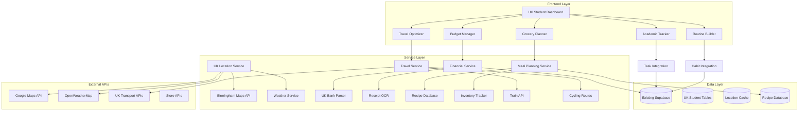

# Design Document

## Overview

The UK Student Life Optimization module integrates with the existing MessyOS architecture to provide location-aware, context-specific optimization for Birmingham UK students. This system leverages the current Astro + Supabase + TypeScript stack while adding new specialized services for grocery planning, travel optimization, financial budgeting, and routine rebuilding.

The design builds upon existing modules (habits, tasks, finance, calendar) and adds new UK-specific intelligence layers that understand local context like Birmingham geography, UK banking systems, university schedules, and student lifestyle patterns.

## Architecture

### High-Level System Architecture



### Integration with Existing MessyOS

The UK Student Life Optimization module extends the current MessyOS architecture by:

1. **Leveraging Existing Infrastructure**: Uses current Supabase database, authentication system, and Astro framework
2. **Extending Current Modules**: Enhances habits, tasks, finance, and calendar with UK-specific intelligence
3. **Adding Specialized Services**: New services for location awareness, meal planning, and travel optimization
4. **Maintaining Consistency**: Follows existing patterns for API routes, components, and data structures

## Components and Interfaces

### Core Components

#### 1. UK Student Dashboard Component
```typescript
// src/components/uk-student/UKStudentDashboard.tsx
interface UKStudentDashboardProps {
  user: User;
  preferences: UKStudentPreferences;
}

interface UKStudentPreferences {
  homeLocation: 'five-ways' | 'selly-oak' | 'university' | 'other';
  transportPreference: 'bike' | 'train' | 'mixed';
  budgetLimits: {
    weekly: number;
    monthly: number;
    categories: Record<string, number>;
  };
  mealPreferences: {
    cookingTime: { breakfast: number; lunch: number; dinner: number };
    dietaryRestrictions: string[];
    bulkCookingFrequency: number;
  };
  academicSchedule: {
    classSchedule: CalendarEvent[];
    assignmentDeadlines: Task[];
    examPeriods: DateRange[];
  };
}
```

#### 2. Grocery and Meal Planning Component
```typescript
// src/components/uk-student/GroceryPlanner.tsx
interface GroceryPlannerProps {
  currentInventory: InventoryItem[];
  weeklyMealPlan: MealPlan;
  nearbyStores: Store[];
  budget: BudgetConstraints;
}

interface MealPlan {
  meals: {
    [date: string]: {
      breakfast: Recipe | null;
      lunch: Recipe | null;
      dinner: Recipe | null;
    };
  };
  shoppingList: ShoppingItem[];
  totalCost: number;
  nutritionSummary: NutritionInfo;
}

interface Store {
  name: 'aldi' | 'tesco' | 'premier' | 'sainsburys' | 'university-superstore' | 'gopuff';
  location: Location;
  walkingTime: number;
  cyclingTime: number;
  priceLevel: 'budget' | 'mid' | 'premium';
  openingHours: OpeningHours;
}
```

#### 3. Travel Optimization Component
```typescript
// src/components/uk-student/TravelOptimizer.tsx
interface TravelOptimizerProps {
  dailySchedule: CalendarEvent[];
  weatherForecast: WeatherData[];
  userPreferences: TravelPreferences;
}

interface TravelRoute {
  from: Location;
  to: Location;
  method: 'bike' | 'train' | 'walk';
  duration: number;
  cost: number;
  weatherSuitability: number;
  energyRequired: number;
  alternatives: TravelRoute[];
}

interface Location {
  name: string;
  coordinates: [number, number];
  type: 'home' | 'university' | 'gym' | 'store' | 'other';
}
```

#### 4. Financial Budgeting Component
```typescript
// src/components/uk-student/BudgetManager.tsx
interface BudgetManagerProps {
  accounts: UKBankAccount[];
  expenses: Expense[];
  budgetLimits: BudgetLimits;
  spendingAnalytics: SpendingAnalytics;
}

interface UKBankAccount {
  type: 'monzo' | 'iq-prepaid' | 'icici-uk';
  balance: number;
  currency: 'GBP';
  lastSync: Date;
  transactions: Transaction[];
}

interface SpendingAnalytics {
  weeklyTrend: number[];
  categoryBreakdown: Record<string, number>;
  unusualSpending: Alert[];
  savingsOpportunities: Recommendation[];
}
```

### Service Interfaces

#### 1. UK Location Service
```typescript
// src/lib/services/uk-location-service.ts
interface UKLocationService {
  getBirminghamRoute(from: Location, to: Location, method: TransportMethod): Promise<RouteInfo>;
  getNearbyStores(location: Location, radius: number): Promise<Store[]>;
  getWeatherForecast(location: Location, days: number): Promise<WeatherData[]>;
  calculateTravelTime(route: RouteInfo, conditions: TravelConditions): number;
}

interface RouteInfo {
  distance: number;
  duration: number;
  elevation: number;
  difficulty: 'easy' | 'moderate' | 'hard';
  weatherSuitability: number;
  safetyRating: number;
}
```

#### 2. Meal Planning Service
```typescript
// src/lib/services/meal-planning-service.ts
interface MealPlanningService {
  generateWeeklyPlan(constraints: MealConstraints): Promise<MealPlan>;
  suggestRecipes(ingredients: string[], timeLimit: number): Promise<Recipe[]>;
  optimizeShoppingList(meals: Recipe[], stores: Store[]): Promise<OptimizedShoppingList>;
  trackInventory(items: InventoryItem[]): Promise<InventoryStatus>;
}

interface Recipe {
  id: string;
  name: string;
  ingredients: Ingredient[];
  cookingTime: number;
  difficulty: number;
  nutrition: NutritionInfo;
  storageInfo: StorageInfo;
  bulkCookingMultiplier: number;
}
```

#### 3. Financial Integration Service
```typescript
// src/lib/services/uk-finance-service.ts
interface UKFinanceService {
  parseUKBankStatement(file: File, bankType: UKBankType): Promise<Transaction[]>;
  processReceiptOCR(image: File): Promise<ReceiptData>;
  categorizeUKExpense(transaction: Transaction): Promise<ExpenseCategory>;
  calculateBudgetHealth(expenses: Expense[], limits: BudgetLimits): Promise<BudgetHealth>;
}

interface ReceiptData {
  store: string;
  items: ReceiptItem[];
  total: number;
  date: Date;
  confidence: number;
}
```

## Data Models

### Database Schema Extensions

```sql
-- UK Student specific tables extending existing schema

-- Inventory tracking for meal planning
CREATE TABLE uk_student_inventory (
  id UUID PRIMARY KEY DEFAULT gen_random_uuid(),
  user_id UUID REFERENCES auth.users(id),
  item_name TEXT NOT NULL,
  quantity NUMERIC NOT NULL,
  unit TEXT NOT NULL,
  expiry_date DATE,
  purchase_date DATE,
  store TEXT,
  cost NUMERIC,
  category TEXT,
  location TEXT DEFAULT 'fridge', -- fridge, pantry, freezer
  created_at TIMESTAMPTZ DEFAULT NOW(),
  updated_at TIMESTAMPTZ DEFAULT NOW()
);

-- Meal plans and recipes
CREATE TABLE uk_student_meal_plans (
  id UUID PRIMARY KEY DEFAULT gen_random_uuid(),
  user_id UUID REFERENCES auth.users(id),
  week_start_date DATE NOT NULL,
  meals JSONB NOT NULL, -- Weekly meal schedule
  shopping_list JSONB NOT NULL,
  total_cost NUMERIC,
  nutrition_summary JSONB,
  created_at TIMESTAMPTZ DEFAULT NOW()
);

-- Travel routes and preferences
CREATE TABLE uk_student_travel_routes (
  id UUID PRIMARY KEY DEFAULT gen_random_uuid(),
  user_id UUID REFERENCES auth.users(id),
  from_location TEXT NOT NULL,
  to_location TEXT NOT NULL,
  preferred_method TEXT NOT NULL,
  duration_minutes INTEGER,
  cost_pence INTEGER,
  weather_conditions JSONB,
  frequency_used INTEGER DEFAULT 0,
  last_used TIMESTAMPTZ,
  created_at TIMESTAMPTZ DEFAULT NOW()
);

-- UK-specific financial data
CREATE TABLE uk_student_expenses (
  id UUID PRIMARY KEY DEFAULT gen_random_uuid(),
  user_id UUID REFERENCES auth.users(id),
  amount NUMERIC NOT NULL,
  currency TEXT DEFAULT 'GBP',
  description TEXT,
  category TEXT,
  store TEXT,
  location TEXT,
  payment_method TEXT, -- monzo, iq-prepaid, icici-uk, cash
  receipt_data JSONB,
  transaction_date DATE NOT NULL,
  created_at TIMESTAMPTZ DEFAULT NOW()
);

-- Academic schedule integration
CREATE TABLE uk_student_academic_events (
  id UUID PRIMARY KEY DEFAULT gen_random_uuid(),
  user_id UUID REFERENCES auth.users(id),
  title TEXT NOT NULL,
  type TEXT NOT NULL, -- class, assignment, exam, deadline
  start_time TIMESTAMPTZ NOT NULL,
  end_time TIMESTAMPTZ,
  location TEXT,
  building TEXT,
  importance INTEGER DEFAULT 3, -- 1-5 scale
  preparation_time INTEGER, -- minutes needed
  travel_time INTEGER, -- minutes to get there
  created_at TIMESTAMPTZ DEFAULT NOW()
);

-- Personal care and routine tracking
CREATE TABLE uk_student_routines (
  id UUID PRIMARY KEY DEFAULT gen_random_uuid(),
  user_id UUID REFERENCES auth.users(id),
  routine_type TEXT NOT NULL, -- morning, evening, skincare, laundry
  steps JSONB NOT NULL, -- Array of routine steps
  estimated_duration INTEGER, -- minutes
  frequency TEXT, -- daily, weekly, etc.
  last_completed TIMESTAMPTZ,
  completion_streak INTEGER DEFAULT 0,
  created_at TIMESTAMPTZ DEFAULT NOW()
);

-- Location and store data
CREATE TABLE uk_student_locations (
  id UUID PRIMARY KEY DEFAULT gen_random_uuid(),
  name TEXT NOT NULL,
  type TEXT NOT NULL, -- store, university, gym, home
  address TEXT,
  coordinates POINT,
  opening_hours JSONB,
  price_level TEXT, -- budget, mid, premium
  user_rating INTEGER, -- 1-5 stars
  notes TEXT,
  created_at TIMESTAMPTZ DEFAULT NOW()
);
```

### TypeScript Interfaces

```typescript
// Core data models for UK Student module

interface UKStudentProfile {
  userId: string;
  homeLocation: Location;
  universitySchedule: AcademicEvent[];
  transportPreferences: TransportPreferences;
  budgetLimits: BudgetLimits;
  dietaryPreferences: DietaryPreferences;
  routinePreferences: RoutinePreferences;
}

interface InventoryItem {
  id: string;
  name: string;
  quantity: number;
  unit: string;
  expiryDate?: Date;
  location: 'fridge' | 'pantry' | 'freezer';
  category: string;
  cost?: number;
}

interface MealPlan {
  weekStartDate: Date;
  meals: {
    [date: string]: {
      breakfast?: Recipe;
      lunch?: Recipe;
      dinner?: Recipe;
    };
  };
  shoppingList: ShoppingItem[];
  totalCost: number;
  nutritionSummary: NutritionInfo;
}

interface TravelPlan {
  date: Date;
  routes: TravelRoute[];
  totalCost: number;
  totalTime: number;
  weatherConsiderations: string[];
  alternatives: TravelRoute[];
}

interface BudgetAnalysis {
  weeklySpending: number;
  monthlySpending: number;
  categoryBreakdown: Record<string, number>;
  budgetHealth: {
    score: number;
    status: 'good' | 'warning' | 'critical';
    recommendations: string[];
  };
  savingsOpportunities: Recommendation[];
}
```

## Error Handling

### Error Categories and Handling Strategy

#### 1. External API Failures
```typescript
// Graceful degradation for external services
class UKLocationService {
  async getBirminghamRoute(from: Location, to: Location): Promise<RouteInfo> {
    try {
      // Try Google Maps API first
      return await this.googleMapsRoute(from, to);
    } catch (error) {
      try {
        // Fallback to cached routes
        return await this.getCachedRoute(from, to);
      } catch (cacheError) {
        // Final fallback to estimated route
        return this.estimateRoute(from, to);
      }
    }
  }
}
```

#### 2. Data Validation and Sanitization
```typescript
// Input validation for financial data
interface ExpenseValidation {
  validateAmount(amount: number): ValidationResult;
  validateStore(store: string): ValidationResult;
  validateCategory(category: string): ValidationResult;
  sanitizeDescription(description: string): string;
}

class ExpenseValidator implements ExpenseValidation {
  validateAmount(amount: number): ValidationResult {
    if (amount <= 0) return { valid: false, error: 'Amount must be positive' };
    if (amount > 10000) return { valid: false, error: 'Amount seems unusually high' };
    return { valid: true };
  }
}
```

#### 3. OCR and File Processing Errors
```typescript
// Robust receipt processing with fallbacks
class ReceiptProcessor {
  async processReceipt(file: File): Promise<ReceiptData> {
    try {
      const ocrResult = await this.performOCR(file);
      return this.parseReceiptText(ocrResult);
    } catch (ocrError) {
      // Fallback to manual entry prompt
      return this.promptManualEntry(file);
    }
  }
  
  private async promptManualEntry(file: File): Promise<ReceiptData> {
    // Return partial data and request user input
    return {
      store: 'Unknown',
      items: [],
      total: 0,
      date: new Date(),
      confidence: 0,
      requiresManualInput: true
    };
  }
}
```

#### 4. Network and Connectivity Issues
```typescript
// Offline-first approach for critical features
class OfflineCapableService {
  async syncWhenOnline(): Promise<void> {
    if (navigator.onLine) {
      await this.syncPendingData();
    } else {
      // Queue for later sync
      await this.queueForSync();
    }
  }
  
  async queueForSync(): Promise<void> {
    // Store in IndexedDB for offline access
    const offlineData = await this.getOfflineStorage();
    await offlineData.add('pending_sync', this.pendingData);
  }
}
```

## Testing Strategy

### Unit Testing Approach

#### 1. Service Layer Testing
```typescript
// Example test for meal planning service
describe('MealPlanningService', () => {
  let service: MealPlanningService;
  
  beforeEach(() => {
    service = new MealPlanningService();
  });
  
  test('generates meal plan within budget constraints', async () => {
    const constraints = {
      budget: 50, // £50 per week
      cookingTime: { breakfast: 10, lunch: 20, dinner: 30 },
      dietaryRestrictions: []
    };
    
    const plan = await service.generateWeeklyPlan(constraints);
    
    expect(plan.totalCost).toBeLessThanOrEqual(50);
    expect(plan.meals).toHaveProperty('2024-11-12');
  });
  
  test('handles inventory constraints correctly', async () => {
    const inventory = [
      { name: 'eggs', quantity: 6, unit: 'pieces' },
      { name: 'bread', quantity: 1, unit: 'loaf' }
    ];
    
    const recipes = await service.suggestRecipes(['eggs', 'bread'], 15);
    
    expect(recipes).toContainEqual(
      expect.objectContaining({ name: expect.stringContaining('egg') })
    );
  });
});
```

#### 2. Component Testing
```typescript
// Testing UK Student Dashboard component
describe('UKStudentDashboard', () => {
  test('displays current weather and travel recommendations', () => {
    const mockProps = {
      user: mockUser,
      preferences: mockPreferences,
      weather: { condition: 'rainy', temperature: 8 }
    };
    
    render(<UKStudentDashboard {...mockProps} />);
    
    expect(screen.getByText(/rainy/i)).toBeInTheDocument();
    expect(screen.getByText(/train recommended/i)).toBeInTheDocument();
  });
});
```

#### 3. Integration Testing
```typescript
// Testing full workflow from expense input to budget analysis
describe('Expense to Budget Integration', () => {
  test('processes receipt OCR and updates budget analysis', async () => {
    const receiptFile = new File(['mock receipt'], 'receipt.jpg');
    
    // Process receipt
    const receiptData = await receiptProcessor.processReceipt(receiptFile);
    
    // Add to expenses
    await expenseService.addExpense(receiptData);
    
    // Check budget update
    const budgetAnalysis = await budgetService.getCurrentAnalysis(userId);
    
    expect(budgetAnalysis.weeklySpending).toBeGreaterThan(0);
  });
});
```

### End-to-End Testing Scenarios

#### 1. Daily Planning Workflow
```typescript
// Test complete daily planning from wake-up to sleep
test('complete daily planning workflow', async () => {
  // User wakes up at 7:30 AM
  await planningService.generateDailyPlan(userId, {
    wakeTime: '07:30',
    schedule: mockUniversitySchedule,
    preferences: mockPreferences
  });
  
  // Check gym is scheduled before 9 AM class
  const plan = await planningService.getDailyPlan(userId, today);
  const gymSlot = plan.activities.find(a => a.type === 'gym');
  const firstClass = plan.activities.find(a => a.type === 'class');
  
  expect(gymSlot.startTime).toBeLessThan(firstClass.startTime);
});
```

#### 2. Budget Alert Workflow
```typescript
// Test budget monitoring and alerts
test('budget alert system works correctly', async () => {
  // Add expenses that exceed weekly limit
  await expenseService.addExpense({
    amount: 60, // £60 when limit is £50
    category: 'groceries',
    date: new Date()
  });
  
  // Check alert is generated
  const alerts = await alertService.getActiveAlerts(userId);
  
  expect(alerts).toContainEqual(
    expect.objectContaining({
      type: 'budget_exceeded',
      category: 'groceries'
    })
  );
});
```

### Performance Testing

#### 1. Route Calculation Performance
```typescript
// Ensure route calculations complete within acceptable time
test('route calculation performance', async () => {
  const startTime = Date.now();
  
  const route = await locationService.getBirminghamRoute(
    { name: 'Five Ways', coordinates: [52.4751, -1.9180] },
    { name: 'University', coordinates: [52.4508, -1.9305] }
  );
  
  const duration = Date.now() - startTime;
  
  expect(duration).toBeLessThan(2000); // Under 2 seconds
  expect(route).toHaveProperty('duration');
});
```

#### 2. Meal Planning Optimization
```typescript
// Test meal planning algorithm performance
test('meal planning completes within time limit', async () => {
  const constraints = {
    budget: 100,
    days: 7,
    recipes: 50 // Large recipe database
  };
  
  const startTime = Date.now();
  const plan = await mealPlanningService.generateWeeklyPlan(constraints);
  const duration = Date.now() - startTime;
  
  expect(duration).toBeLessThan(5000); // Under 5 seconds
  expect(plan.meals).toHaveProperty('2024-11-12');
});
```

This comprehensive design provides a solid foundation for implementing the UK Student Life Optimization features while maintaining consistency with your existing MessyOS architecture. The design emphasizes practical solutions for your specific Birmingham UK student context while building on your current technical stack.